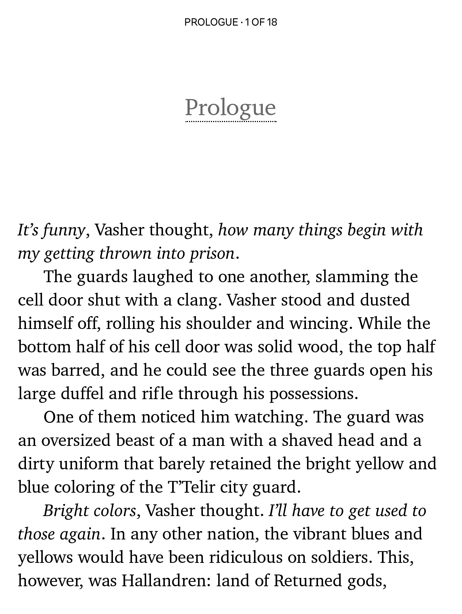
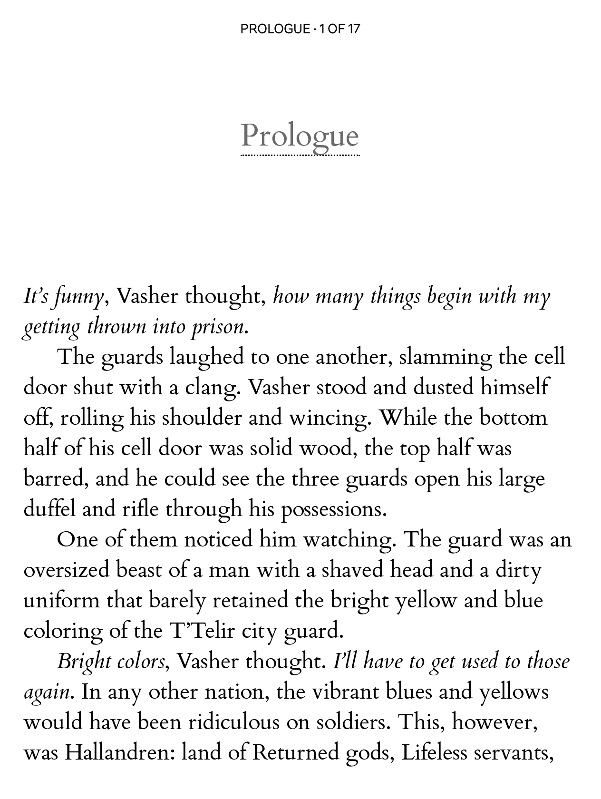

# Modified fonts for e-reading

This is a selection of fonts that I've tweaked for reading purposes on Kobo devices. These fonts can also be used other devices, including Kindle, Pocketbook, and may also work well for general use (i.e. word processing).

> [!IMPORTANT]
> **If you found these fonts useful, please consider starring the repository**, it helps me understand how useful my work has been.

## What is this?

**This is a repository that includes various fonts that have been altered in some minor way for better compatibility with e-readers, in particular Kobo devices.**

For some fonts, font family names have been altered, sometimes glyphs have been altered, sometimes metrics have been altered, all to improve the readability on E Ink displays.

The main use of these fonts is for usage on an e-reader. I've only selected and altered fonts that I have the rights to alter because of their license (e.g. free/libre license or equivalent).

These alterations were made for my own personal use, but I figure these fonts may be of use to others, so I make them available here. While font names have been changed and this is allowed due to the licensing of each of the source fonts, I have not modified any copyright messages included in the font files and included attribution to the original authors in the document below. 

**I have also linked to the original fonts, too.** Some of these have a really interesting history behind them, so I encourage you to read a bit more about these beautiful fonts. You may find the originals useful for your own projects! Since this repository only offers a maximum of 4 versions for each font family, you may find the originals a better choice for e.g. desktop publishing programs and such. 

If you're curious, you can learn more about how and why I originally made these tweaked fonts on my website: [Patching Fonts for my Kobo](https://nicoverbruggen.be/blog/patching-fonts-for-kobo). I explain there how this repository came to be.

## Core fonts

The _core_ collection is a selection of my very favorite fonts, and the ones that I consider to the highest quality ones.

### NV Charter

<kbd></kbd>

**NV Charter** is a renamed version of [XCharter](https://www.ctan.org/tex-archive/fonts/xcharter/), which is an extended version of [Bitstream Charter](https://en.wikipedia.org/wiki/Bitstream_Charter). This one has a [dedicated repository](https://github.com/nicoverbruggen/nv-charter) that I've linked. Available under [this license](https://github.com/nicoverbruggen/nv-charter/blob/main/LICENSE) which lets you use, copy, modify, sublicense, sell and redistribute this font.

> Charter was designed by Matthew Carter in 1987 as a body text font that would hold up well on low-resolution output devices of the day—fax machines and 300 dpi laser printers. XCharter is a project by Michael Sharpe, which extends Bitstream's Charter. An extended copyright notice has been included as part of the font files.

### NV Garamond

<kbd></kbd>

**NV Garamond** is an EB Garamond version that contains a bunch of tweaks, mostly related to glyph sizes. This version is about 10% optically larger than EB Garamond, which, with an adjusted line height, makes it ideal for reading on Kobo devices. This version has a [dedicated repository](https://github.com/nicoverbruggen/nv-garamond) that I've linked because of the manual edits that I've made.

> You can also find the original version of EB Garamond [on Google Web Fonts](https://fonts.google.com/specimen/EB+Garamond/about). EB Garamond was designed by Octavio Pardo and Georg Duffner, and created as an open source revival of Claude Garamont's original design, based on the Berner specimen. You can learn more about the project [here](http://www.georgduffner.at/ebgaramond/). It is available under the [OFL license](https://openfontlicense.org/).

### NV Membo

<kbd></kbd>

**NV Membo** is a renamed version of [fbb](https://www.ctan.org/tex-archive/fonts/fbb), a modified version of Cardo which has a Bold Italic style, unlike NV Cardo. It has been converted to TrueType (`ttf`) for better Kobo compatibility.

> You can find the original version of fbb [on CTAN](https://www.ctan.org/tex-archive/fonts/fbb). The package provides a Bembo-like font package based on Cardo but with many modifications, adding Bold Italic, small caps in all styles, six figure choices in all styles, updated kerning tables, added figure tables and corrected f-ligatures.

**Note:** If you need extended character support for foreign languages (e.g. Cyrillic, Greek), please check out _Cardo_ in the extras section below.

### NV Jost

<kbd></kbd>

**NV Jost** is a Jost variant, with a slightly altered lowercase G and single storey a (similar to Futura, only accessible via OT feature on the original font). This one has a [dedicated repository](https://github.com/nicoverbruggen/nv-jost), mostly because I made some glyph alterations.

> You can find the original version of Jost [on Google Web Fonts](https://fonts.google.com/specimen/Jost/about). Jost was designed by Owen Earl of [indestructable type*](https://indestructibletype.com). It is available under the [OFL license](https://openfontlicense.org/).

### NV Bitter

<kbd></kbd>

**NV Bitter** is a version of [Bitter](https://github.com/solmatas/BitterPro) that has been renamed so it works correctly on Kobo devices.

> You can find the original version of Bitter [on Google Web Fonts](https://fonts.google.com/specimen/Bitter/about). Bitter was designed by [Sol Matas](http://www.solmatas.com/), and available under the [OFL license](https://openfontlicense.org/).

**Note:** The original font is included by default on newer Kobo devices, but I recommend using this version.

 ### NV Georsio

<kbd></kbd>

**NV Georsio** is a modified version of Gelasio, which was created to have identical metrics to Georgia, one of the [web's core fonts](https://en.wikipedia.org/wiki/Core_fonts_for_the_Web) thanks to Microsoft making it available on pretty much every PC and Mac in the world.

> You can find the original version of Gelasio [on Google Web Fonts](https://fonts.google.com/specimen/Gelasio/about). Gelasio was designed by Eben Sorkin. Gelasio is an original typeface that has metrics compatible with Georgia in its Regular, Bold, Italic and Bold Italic weights. Its design was inspired by an original printed sample of a French Transitional typeface which follows the Romain Du Roi typeface introduced in 1702. It is available under the [OFL license](https://openfontlicense.org/).

**Note**: Georgia used to be the default font on older Kobo devices, and if you really liked it you can consider this to be a very similar alternative. With the release of Kobo Libra Color and Kobo Clara Color, Rakuten Serif is now the default font.

### NV Legible

<kbd></kbd>

**NV Legible** is a variant of Atkinson Hyperlegible Next. This is a refined version of the original Atkinson Hyperlegible released in 2025. Because "Atkinson Hyperlegible Next" is a very long name, I decided to shorten it up a bit for your e-reader.

> You can find the original version of Atkinson Hyperlegible Next [on Google Web Fonts](https://fonts.google.com/specimen/Atkinson+Hyperlegible+Next/about). Designed by: Braille Institute, Applied Design Works, Elliott Scott, Megan Eiswerth, Letters From Sweden. Named after the founder of the Braille Institute, Atkinson Hyperlegible Next has been developed specifically to increase legibility for readers with low vision, and to improve reading comprehension.

**Note:** The previous version of this font is included by default on newer Kobo devices, but I recommend using this version since it is newer.

### NV Palatium

<kbd></kbd>

**NV Palatium**, is a renamed version of [Domitian](https://www.ctan.org/tex-archive/fonts/domitian/), which is an extended version of [URW Palladio](https://tug.org/FontCatalogue/urwpalladio/). This one has a [dedicated repository](https://github.com/nicoverbruggen/nv-palatium) that I've linked because I've expanded and updated the embedded license in each of the font files.

> You can find the original version of Domitian [on GitHub](https://github.com/dbenjaminmiller/domitian). Designed by: Hermann Zapf, Daniel Benjamin Miller. Domitian is a project to develop a full-featured, free and open-source implementation of Hermann Zapf's Palatino design. "Domitian" is in refrerence to builder of the Flavian Palace, located on the Palatine Hill. It is available under various licenses, including the [OFL license](https://openfontlicense.org/).

## Extra fonts

Also included are a set of extra fonts. Because this list remains in flux and can potentially grow, I do not have screenshots for each and every one of them.

- **NV Adelph** is a variant of the [Adelphe](https://gitlab.com/bye-bye-binary/adelphe). I've altered the metrics for adjusted line height. [OIFL licensed](https://typotheque.genderfluid.space/fr/licences), like the original. (If you're curious, this is in essence a more gender-inclusive version of the OFL, so you can use the font in the exact same way as any OFL-licensed font.)

- **NV Basker** is a variant of [ANRT-Baskervville](https://github.com/anrt-type/ANRT-Baskervville). I've altered the metrics for adjusted line height, and the medium weight is used for text, as opposed to the regular weight. OFL licensed.

- **NV Cardo** is a version of [Cardo](https://github.com/ryanfb/Cardo) with 20% spacing and has been renamed so you can keep the original Cardo installed side-by-side as well. Does not have a separate repository because no other changes were applied. OFL licensed.

- **NV Charis** is a version of [Charis](https://software.sil.org/charis/) 7.0 by SIL with a slightly more narrow line-height. It is very similar to Charter, but under a more permissive license. OFL licensed.

- **NV Charter Basic** is simply a tweaked version of the original Charter, without the additions of XCharter. Hence, basic. Available under [this license](https://github.com/nicoverbruggen/nv-charter/blob/main/LICENSE) which lets you use, copy, modify, sublicense, sell and redistribute this font.

- **NV Cooper** is a renamed version of [Cooper](https://indestructibletype.com/Cooper/). It's another beautiful font made by Owen Earl of [indestructable type*](https://indestructibletype.com). I've altered the metrics for adjusted line height. OFL licensed.

- **NV Elstob** is a version of [Elstob](https://github.com/psb1558/Elstob-font) that has been renamed so it works correctly on Kobo devices. It is based on the 12pt version. Does not have a separate repository because no other changes were applied. OFL licensed.

- **NV Gentium** is a version of [Gentium](https://software.sil.org/gentium/) Book 7.0 with corrected PANOSE information for the Bold and Bold Italic weights, which was incorrect. This modified version ensures the font is displayed correctly on Kobo devices. OFL licensed.

- **NV Junius** is a [Junicode 2](https://github.com/psb1558/Junicode-font) variant based on the variable font, with adjusted metrics and a 10% glyph size increase. This one does not have a repository, but can be easily recreated by using [Slice](https://github.com/source-foundry/Slice), a GUI that allows you to export various fixed configurations. OFL licensed.

- **NV Libertinus** is a variant of [Libertinus](https://github.com/alerque/libertinus) Serif. I've altered the metrics for adjusted line height. OFL licensed.

- **NV Lore** is a variant of [Lora](https://github.com/cyrealtype/Lora-Cyrillic). I've altered the metrics for adjusted line height. OFL licensed.

- **NV Newsreader** is a variant of [Newsreader](https://fonts.google.com/specimen/Newsreader). Based on a particular weight that is ideal for e-reading. OFL licensed.

- **NV Old Style** is a variant of QT Caslan from the [QualiType fonts package](https://ctan.org/pkg/qualitype?lang=en). Renamed and converted to TrueType for optimal Kobo reading. OFL licensed.

- **NV Scarlet** is a renamed version of [Crimson](https://github.com/skosch/Crimson)'s 2012 version. I personally find it to be a better choice for digital reading than the more modern version of Crimson Pro. This version has been optically resized for optimal reading on Kobo devices. OFL-licensed.

- **NV Source Serif** is a version of [Source Serif 4](https://github.com/adobe-fonts/source-serif) with 20% spacing and has been renamed so it works correctly on Kobo devices. OFL licensed.

- **NV Technical** is a variant of [STIX Two Text](https://fonts.google.com/specimen/STIX+Two+Text/about). OFL licensed. (Note: If you use a Kobo that has stylus support, STIX Two Text will likely already be included on your device.)

## How to install

To install these fonts on your Kobo, unzip the files and drag the font files into the `fonts` directory at the root of your Kobo device after connecting your Kobo to your PC via USB cable. You may need to create the `fonts` directory. Drag the `.ttf` and `.otf` files into the `fonts` directory, do not use subfolders.

**I recommend rebooting your Kobo after installing the fonts to make sure they work correctly. A reboot is REQUIRED if you already had other versions of these fonts installed on your device, or the new versions won't be used.**

To reboot, long-press the power button until your Kobo says it has been shut down. Then, press the power button again and wait for your device to restart.

## FAQ

### Where can I download these fonts?

The fonts are available via the [releases section](https://github.com/nicoverbruggen/ebook-fonts/releases) on GitHub.

### Do you have any other recommendations other than installing these fonts?

Yes! I highly recommend using [KOReader](https://koreader.rocks/) instead of the built-in functionality that comes with your device, especially if you wish to read books you bought as `epub` files. 

It's the best and most comprehensive digital reading software I know, with excellent font rendering and incredible customization options. It's available for almost all devices you can think of. I highly recommend trying it.

### Why did you alter these fonts?

Please go take a look at my blog post, [Patching Fonts for my Kobo](https://nicoverbruggen.be/blog/patching-fonts-for-kobo). It's part of a series of posts related to customizing fonts for the most optimal (subjective) e-reading experience.

### What tweaks have been applied to these fonts?

All of the **fonts have been renamed** (using [fontname.py](https://github.com/chrissimpkins/fontname.py)). This way, you can keep them installed side-by-side with the original versions, if you'd like. This is also a requirement of the Open Font License, which does not allow you to redistribute the fonts using the original name if they have been altered.

Some practical changes to the fonts themselves have been made, including:

- I've **normalized metrics** for all fonts to a **20% line height** (using `font-line percent 20`). Some fonts rendered poorly on Kobo devices with the line height slider all the way to the left. This fixes that. Some fonts have not been modified if their line spacing was even smaller.
- Incorrect **PANOSE metadata has been corrected** where necessary (using [panosifier](https://github.com/source-foundry/panosifier)). This ensures that the fonts render correctly on Kobo devices. For some fonts, incorrect information meant that the fonts would always render using their Bold style, for example.
- Certain fonts have had their **glyphs rescaled**. Certain fonts have had their glyph sizes increased by 10%, making them seem visually larger, and more consistent in size with the other fonts included in this collection. If you like to stick to a certain font size, you won't need to constantly tweak things if you swap to a different font.
- The Kobo Collection versions of the fonts are optimized for Kobo devices. They were **re-exported with an old style `kern` table** via [kobo-font-fix](https://github.com/nicoverbruggen/kobo-font-fix), to ensure improved kerning is applied for the `kepub` render on Kobo devices.

### How are these fonts licensed?

Most of these fonts are available under their original [Open Font License](https://openfontlicense.org/). Because of licensing rules, the font names have been modified to include a prefix to avoid confusion with the original fonts. 

_NV Charter_ is available under the original Bitstream license. The original LICENSE file is embedded within my version of the fonts, and also included in the repository for legal reasons.

### Is there anything else I should do to to get a better reading experience with these fonts?

If you are manually transferring books to your Kobo devices, you should consider converting `epub` files to `kepub` files. 

To do this, you can use [kepubify](https://pgaskin.net/kepubify/) or use [Calibre](https://calibre-ebook.com/). This ensures that your Kobo device will use a superior and faster book renderer. This renderer also gives you broader font compatibility.

### What version of the Kobo operating system did you last test the fonts with?

The last release was tested on a Kobo Libra Color running firmware version 4.42 and on a Kobo Libra 2 running version firmware 4.38. The screenshots you see above were made on a Kobo Libra 2 running [NickelMenu](https://pgaskin.net/NickelMenu/) with [this configuration](https://github.com/nicoverbruggen/kobo-config).

### What is your favorite font from the collection?

_Charter_ is a timeless classic, so it is my preferred reading font.

### Why did your prefix the fonts with "NV" or "KF"?

Well, those are my initials... also, I like to think of the prefix to mean "Nice Version" or "Nico's Version". I have also modified the font names where necessary. (The alternate variants for Kobo devices are prefixed with "KF", meaning "Kobo Fixed".)

I initially suffixed each of the fonts with "eBook", but I wanted to have shorter font names for display purposes on smaller e-ink devices.

### Can I do anything to fix ligature rendering with the `kepub` renderer on Kobo devices?

Yes, by tweaking `.kobo/Kobo/Kobo eReader.conf`. You can add an override for `webkitTextRenderer`, but this WILL have some unexpected results if you like reading with fully justified text (the default setting).

```
[Reading] # below this line
webkitTextRendering=optimizeLegibility
```

Then, fully restart your Kobo device and now ligatures should render correctly, at the cost of breaking your fully-justified text. (Make sure to choose left-aligned text!)

### Why were some of the font names altered?

Some are easter eggs or fun references to the original name:

- Lore instead of Lora because "Lore" is a Dutch name that is derived from Lora. Since I'm from the Flemish part of Belgium, we speak Dutch here and it's a common name.
- Junius instead of Junicode because the latter actually a shorthand for "Junius-Unicode".
- Palatium as a reference to the Palatine hill in Italy, but it's the Roman name; I couldn't use Palatino and didn't want to use Palatine.
- Membo was decided upon by thinking along the lines of "Modified Bembo-like".
- Old Style instead of "Caslan" which was a clear bastardization of Caslon.

### I've discovered a problem with one of the fonts. What should I do?

If you're having an issue you think I can fix, please get [in touch](mailto:mail@nicoverbruggen.be) with me and let me know what the issue is. I may be able to help.

It is possible that certain issues are resolved by updating the fonts with the upstream version, which may need to happen every now and then.