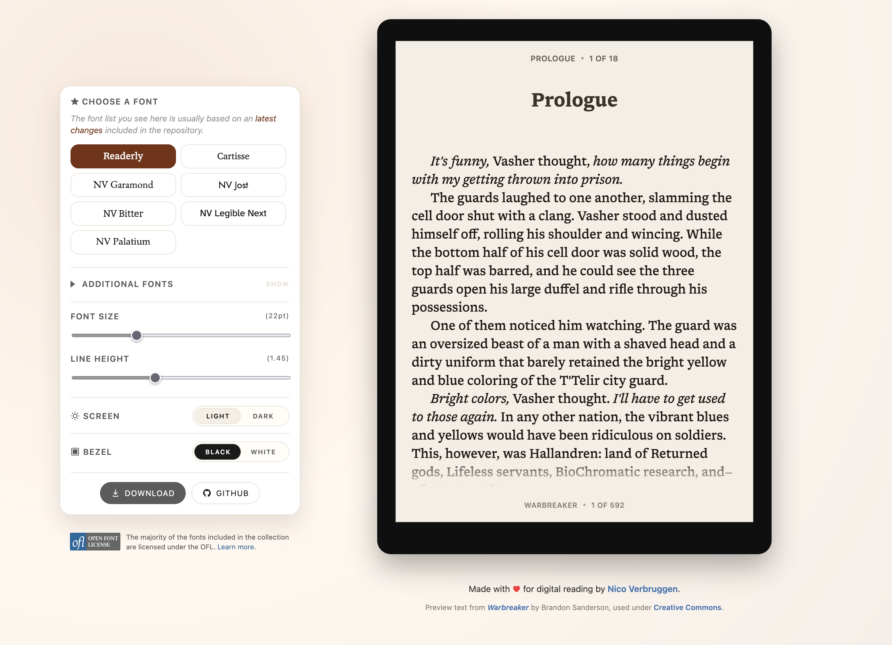
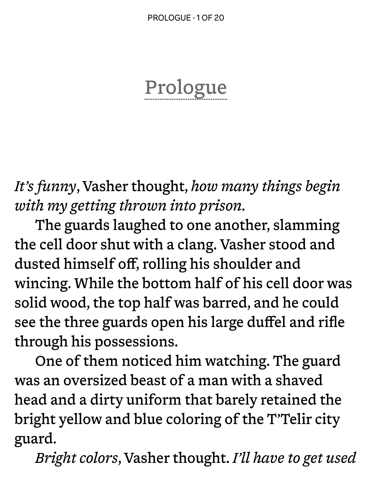
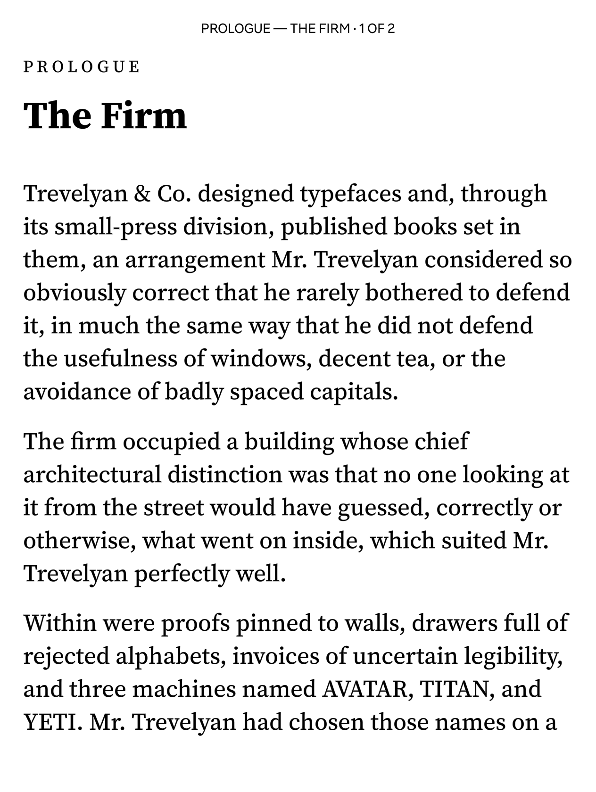
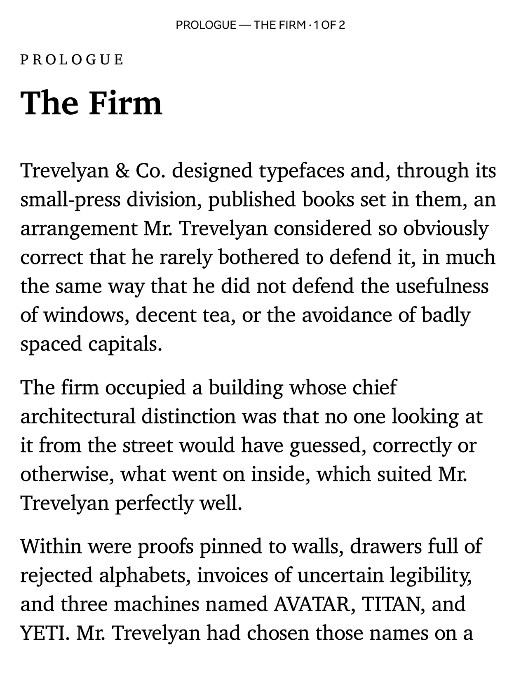
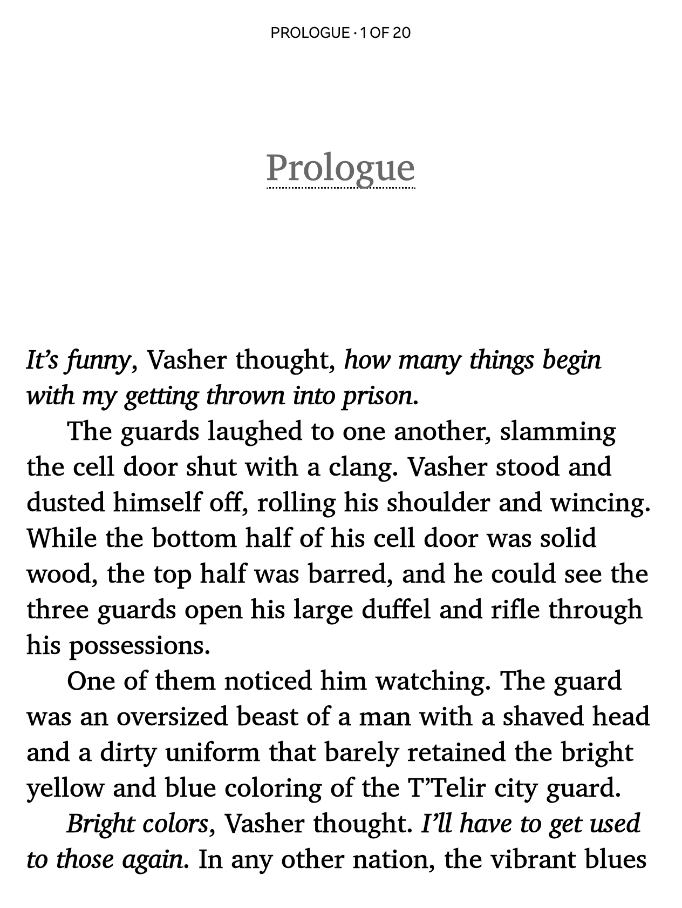
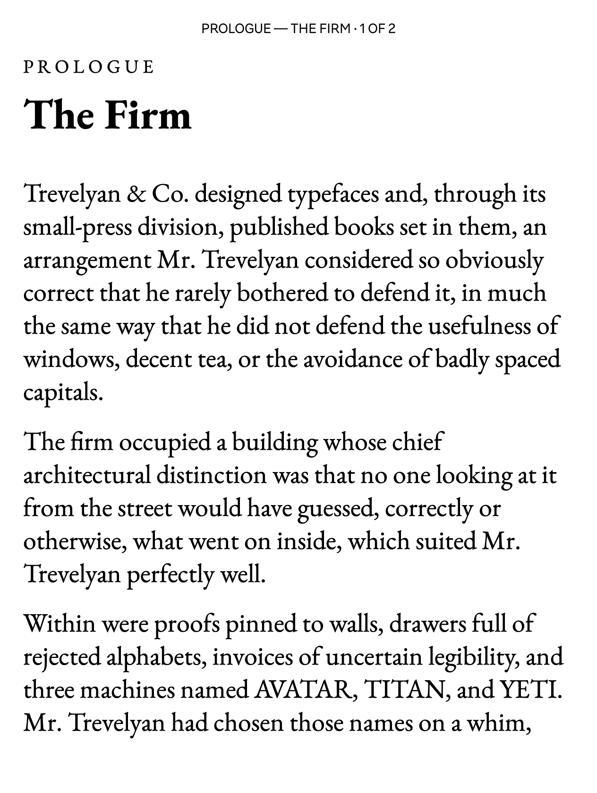
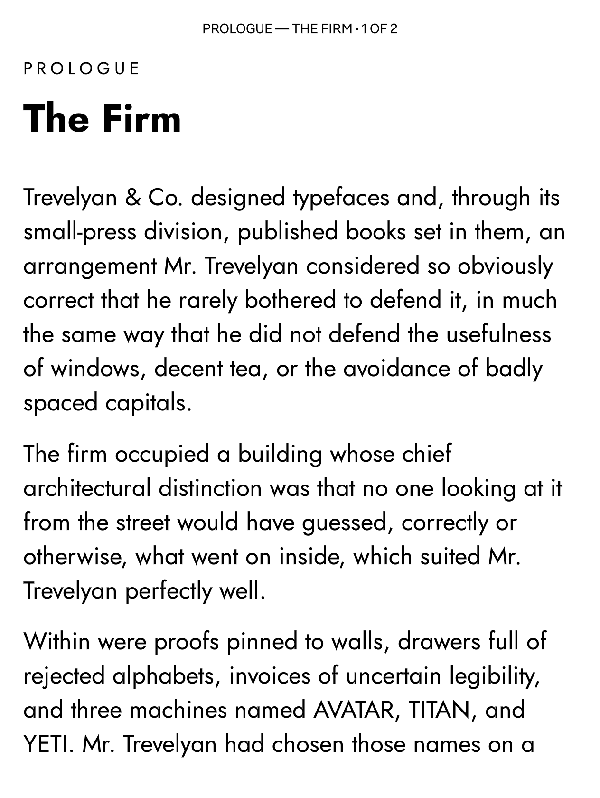
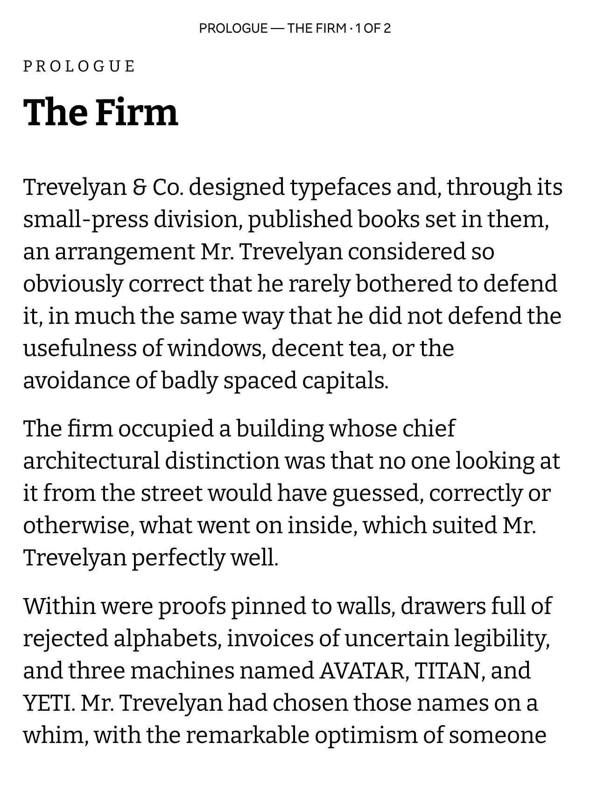
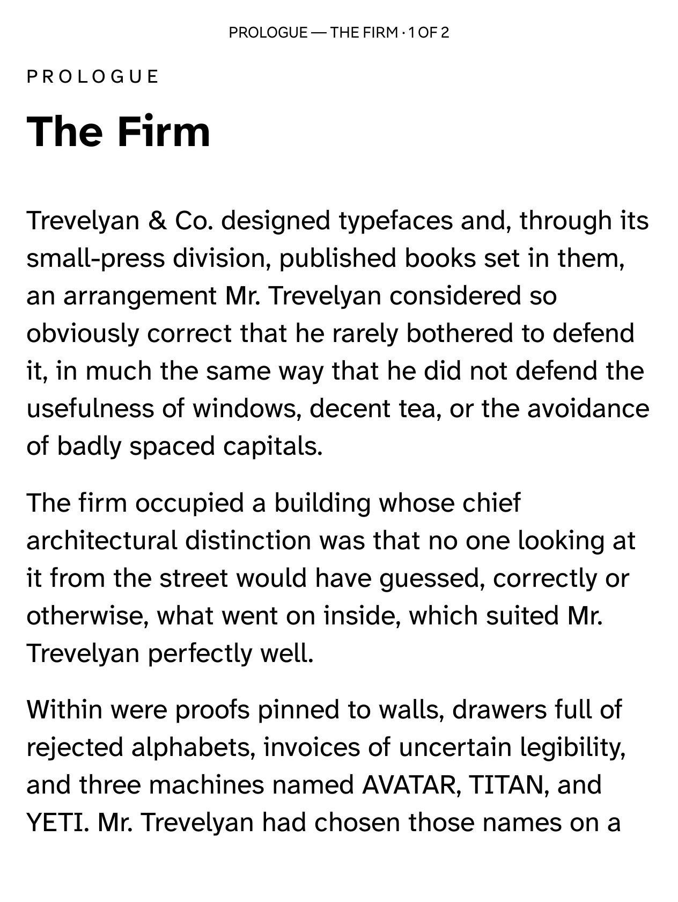
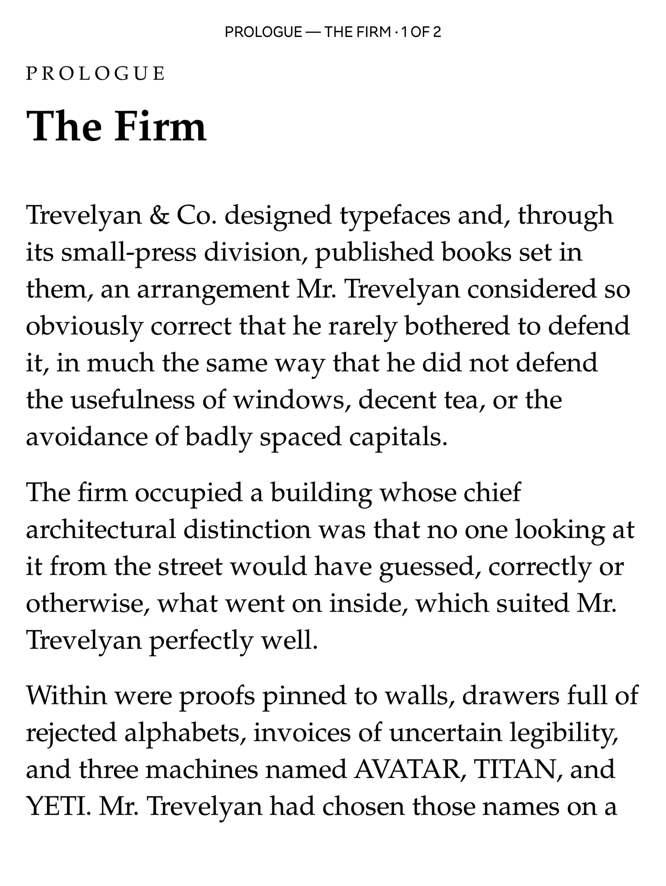

# Modified fonts for e-reading

This is a selection of fonts that I've tweaked for reading purposes on Kobo devices. These fonts can also be used other devices, including Kindle, Pocketbook, and may also work well for general use (i.e. word processing).

> [!IMPORTANT]
> **If you found these fonts useful, please consider starring the repository**, it helps me understand how useful my work has been.

## About this curated collection

### What is this repository?

**This is a repository that includes various fonts that have been altered in some minor way for better compatibility with e-readers, in particular Kobo devices.**

The main use of these fonts is for usage on an e-reader. For some fonts, font family names have been altered, sometimes glyphs have been altered, sometimes metrics have been altered, all to improve the readability on E Ink displays.

I've only selected and altered fonts that I have the **right to alter** because of their license (e.g. **free/libre license** or equivalent). This is important because I want people to be legally able to freely share and modify these fonts. It is because of the existing licenses that these fonts are available at all.

### What about the original fonts?

Where required, font names have been changed, and I have kept any copyright messages included in the font files and included attribution to the original authors in the document below.

**I have also linked to the original fonts, too.** Some of these have a really interesting history behind them, so I encourage you to read a bit more about these beautiful fonts. You may find the originals useful for your own projects! Since this repository only offers a maximum of 4 versions for each font family, you may find the originals a better choice for e.g. desktop publishing programs and such. 

### Interactive showcase

I have also prepared an [interactive showcase](https://ebook-fonts.nicoverbruggen.be/) as a mini website that you can use to check out the fonts. You can customize the font size, line height, and emulate a device with different color bezels and display mode. You can select from all the fonts available in this collection.

<a href="https://ebook-fonts.nicoverbruggen.be/"></a>

If you're curious, you can learn more about how and why I originally made these tweaked fonts on my website: [Patching Fonts for my Kobo](https://nicoverbruggen.be/blog/patching-fonts-for-kobo). I explain there how this repository came to be. This blog post is part of a larger series that I've worked on, so if you are interested in the technical explanation behind all of the changes I've made, I think it's worth reading.

## Core Collection

**The Core Collection is a selection of my very favorite fonts, and the ones that I consider to be the highest quality ones or the best choice for most readers who are looking for a new font.** 

Each of these fonts has solid styles for all four font files (Regular, Italic, Bold and Bold Italic) that modern e-readers require, and have decent glyph coverage, with at least full support for Latin-1, and preferably even more character sets. This is all done to provide you with the optimal reading experience.

### Readerly

<kbd></kbd>

**Readerly** is modified font based on [Newsreader (9pt)](https://github.com/productiontype/Newsreader), while attempting to be metrically very similar to [Bookerly](https://en.wikipedia.org/wiki/Bookerly). The latter is the default font on Kindle devices. This font aims to provide a similar reading experience. A [separate repository](https://github.com/nicoverbruggen/readerly) is available with the source files.

> [Newsreader](https://github.com/productiontype/Newsreader) is an original typeface designed by Production Type, primarily intended for continuous on-screen reading in content-rich environments. It is available under the [OFL license](https://openfontlicense.org/), and so is this derivative version.

_**Nico's Note**: Readerly has become my new default for digital reading on my Kobo Libra Color. (If you prefer the original 9pt version, don't worry: I've also made it available, compatible with Kobo devices as "NinePoint" in the Extra Collection.)_

### Sourcerer

<kbd></kbd>

**Sourcerer** is a thicker version of [Source Serif 4](https://github.com/adobe-fonts/source-serif) with 20% spacing, and has been renamed so it works correctly on Kobo devices (as fonts containing a number will often not work). It is available under the [OFL license](https://openfontlicense.org/).

> [Source Serif](https://github.com/adobe-fonts/source-serif/wiki/Source-Serif-Readme) continues Adobe’s line of high-quality open source typefaces. Designed for a digital environment, the letter shapes are simplified and highly readable. Its historical roots, combined with expert guidance give the typeface a strong character of its own that will shine when used for extended text on paper or screen.

_**Nico's Note**: If you prefer the original (thinner) version of Source Serif, it's included in the Extra collection. However, I've found this version nicer to read on e-ink displays._

### Cartisse

<kbd></kbd>

**Cartisse** is a modified version of [XCharter](https://www.ctan.org/tex-archive/fonts/xcharter/), which is an extended version of [Bitstream Charter](https://en.wikipedia.org/wiki/Bitstream_Charter). This modified version has a [dedicated repository](https://github.com/nicoverbruggen/cartisse) that I've linked since it does contain some manual modifications to kerning specifically made for optimal legibility and appearance on Kobo devices.

> Charter was designed by Matthew Carter in 1987 as a body text font that would hold up well on low-resolution output devices of the day—fax machines and 300 dpi laser printers. XCharter is a project by Michael Sharpe, which extends Bitstream's Charter. An extended copyright notice has been included as part of Cartisse.

_**Note**: Cartisse makes for a great universal pick for most books. It's my choice for a font that doesn't distract while remaining very easy to read._

### NV Charis

<kbd></kbd>

**NV Charis** is a version of [Charis 7.0](https://software.sil.org/charis/) by SIL with a slightly more narrow line-height. It is very similar to Charter, but under a more permissive license. The `i` and `j` stems have also been nudged slightly below x-height so rendering appears more visually correct.

> Charis is very closely based on the design of Bitstream Charter. [...] The glyphs were completely redrawn based only on visual reference to Charter. There are some significant design differences in the serif structure, proportions, diacritics, and Cyrillic. The design was also adjusted and extended to cover a much wider range of characters and publishing needs. It is available under the [OFL license](https://openfontlicense.org/).

_**Note**: Charis is slightly thicker than Cartisse, and has broader language support. If that's what you want, you may want to pick it over Cartisse._

### NV Garamond

<kbd></kbd>

**NV Garamond** is an EB Garamond variant that contains a bunch of tweaks, mostly related to glyph sizes. This version is about 10% optically larger than EB Garamond, which, with an adjusted line height, makes it ideal for reading on Kobo devices. This version has a [dedicated repository](https://github.com/nicoverbruggen/nv-garamond) that I've linked because of the manual edits that I've made.

> You can also find the original version of EB Garamond [on Google Web Fonts](https://fonts.google.com/specimen/EB+Garamond/about). EB Garamond was designed by Octavio Pardo and Georg Duffner, and created as an open source revival of Claude Garamont's original design, based on the Berner specimen. You can learn more about the project [here](http://www.georgduffner.at/ebgaramond/). It is available under the [OFL license](https://openfontlicense.org/).

_**Nico's Note**: Various Garamond variants are commonly used when typesetting for printed books. If you're looking to emulate that feeling of a premium hardback of your favorite fantasy novel, this is the way to go!_

### NV Jost

<kbd></kbd>

**NV Jost** is a Jost variant, with a slightly altered lowercase G and single storey a (similar to Futura, only accessible via OT feature on the original font). This one has a [dedicated repository](https://github.com/nicoverbruggen/nv-jost), mostly because I made some glyph alterations.

> You can find the original version of Jost [on Google Web Fonts](https://fonts.google.com/specimen/Jost/about). Jost was designed by Owen Earl of [indestructable type*](https://indestructibletype.com). It is available under the [OFL license](https://openfontlicense.org/).

_**Nico's Note**: If you're looking for something different, the sans-serif Jost is a great choice. If you're looking for a font that reminds you of [Futura](https://en.wikipedia.org/wiki/Futura_(typeface)), this is the one._

### NV Bitter

<kbd></kbd>

**NV Bitter** is a version of [Bitter](https://github.com/solmatas/BitterPro) that has been renamed, so it can be installed and loaded correctly on old and new Kobo devices. Newer devices may already include Bitter as part of the software, which is why this version has been renamed to avoid conflicts.

> You can find the original version of Bitter [on Google Web Fonts](https://fonts.google.com/specimen/Bitter/about). Bitter was designed by [Sol Matas](http://www.solmatas.com/), and available under the [OFL license](https://openfontlicense.org/).

_**Nico's Note**: Bitter is a gorgeous slab serif font. If you enjoyed Caecilia on other e-readers and it isn't available on your device, this may be a good alternative._

### NV Legible Next

<kbd></kbd>

**NV Legible Next** is a variant of Atkinson Hyperlegible Next. This is a refined version of the original Atkinson Hyperlegible released in 2025. Because "Atkinson Hyperlegible Next" is a very long name, I decided to shorten it up a bit for your e-reader.

> You can find the original version of Atkinson Hyperlegible Next [on Google Web Fonts](https://fonts.google.com/specimen/Atkinson+Hyperlegible+Next/about). Designed by: Braille Institute, Applied Design Works, Elliott Scott, Megan Eiswerth, Letters From Sweden. Named after the founder of the Braille Institute, Atkinson Hyperlegible Next has been developed specifically to increase legibility for readers with low vision, and to improve reading comprehension.

_**Nico's Note**: The previous version of this font is included by default on newer Kobo devices, but I recommend using this version since it is newer; this is the "Hyperlegible Next" variant._

### NV Palatium

<kbd></kbd>

**NV Palatium**, is a renamed version of [Domitian](https://www.ctan.org/tex-archive/fonts/domitian/), which is an extended version of [URW Palladio](https://tug.org/FontCatalogue/urwpalladio/). This one has a [dedicated repository](https://github.com/nicoverbruggen/nv-palatium) that I've linked because I've expanded and updated the embedded license in each of the font files.

> You can find the original version of Domitian [on GitHub](https://github.com/dbenjaminmiller/domitian). Designed by: Hermann Zapf, Daniel Benjamin Miller. Domitian is a project to develop a full-featured, free and open-source implementation of Hermann Zapf's Palatino design. "Domitian" is in reference to builder of the Flavian Palace, located on the Palatine Hill. It is available under various licenses, including the [OFL license](https://openfontlicense.org/).

_**Nico's Note**: If you're looking for a font that reminds you of [Palatino](https://en.wikipedia.org/wiki/Palatino), you will find that Domitian is pretty much the open font equivalent of that classic typeface._

## Extra Collection

**These are additional fonts that I think you should try, as well! Because this list remains in flux and can potentially grow, I do not have screenshots for each and every one of them.**

> If you are interested in checking these fonts out, I recommend trying them via [the showcase website](https://ebook-fonts.nicoverbruggen.be/). You can click on "Additional Fonts" to open the list of extra fonts.

Here's the included fonts, with links to the original and licensing information:

- **NV Adelph** is a variant of the [Adelphe](https://gitlab.com/bye-bye-binary/adelphe). I've altered the metrics for adjusted line height. [OIFL licensed](https://typotheque.genderfluid.space/fr/licences), like the original. (If you're curious, this is in essence a more gender-inclusive version of the OFL, so you can use the font in the exact same way as any OFL-licensed font.)

- **NV Ancizar Serif** is a variant of [UNAL Ancizar Serif](https://github.com/UNAL-OMD/UNAL-Ancizar). I've altered the metrics for adjusted line height. I should note that Ancizar Serif is smaller compared to plenty of the other fonts in this collection, but it actually works well at this smaller optical size. OFL licensed.

- **NV Ancizar Sans** is a variant of [UNAL Ancizar Sans](https://github.com/UNAL-OMD/UNAL-Ancizar). I've altered the metrics for adjusted line height. Effectively the sans serif version of Ancizar Serif, as you might expect. OFL licensed.

- **NV Basker** is a variant of [ANRT-Baskervville](https://github.com/anrt-type/ANRT-Baskervville). I've altered the metrics for adjusted line height, and the medium weight is used for text, as opposed to the regular weight. OFL licensed.

- **NV Cardo** is a version of [Cardo](https://github.com/ryanfb/Cardo) with 20% spacing and has been renamed so you can keep the original Cardo installed side-by-side as well. Does not have a separate repository because no other changes were applied. OFL licensed.

- **NV Charter** is simply a tweaked version of the original [Bitstream Charter](https://en.wikipedia.org/wiki/Bitstream_Charter). Available under [this license](https://github.com/nicoverbruggen/nv-xcharter/blob/main/LICENSE) which lets you use, copy, modify, sublicense, sell and redistribute this font.

- **NV Charis** is a version of [Charis 7.0](https://software.sil.org/charis/) by SIL with a slightly more narrow line-height. It is very similar to Charter, but under a more permissive license.

- **NV Cooper** is a renamed version of [Cooper](https://indestructibletype.com/Cooper/). It's another beautiful font made by Owen Earl of [indestructable type*](https://indestructibletype.com). I've altered the metrics for adjusted line height. OFL licensed.

- **NV Disleksio** is a variant of [OpenDyslexic](https://forge.hackers.town/antijingoist/opendyslexic), based on experiments made on v0.99 of the original in [this repository](https://github.com/nicoverbruggen/odys-compare). OFL licensed. (This revision replaces the original *NV OpenDyslexic* that used to ship with this collection.)

- **NV Elstob** is a version of [Elstob](https://github.com/psb1558/Elstob-font) that has been renamed so it works correctly on Kobo devices. It is based on the 12pt version. Does not have a separate repository because no other changes were applied. OFL licensed.

- **NV Gentium** is a version of [Gentium](https://software.sil.org/gentium/) Book 7.0 with corrected PANOSE information for the Bold and Bold Italic weights, which was incorrect. This modified version ensures the font is displayed correctly on Kobo devices. OFL licensed.

- **NV Georsio** is a modified version of Gelasio, which was created to have identical metrics to Georgia, one of the [web's core fonts](https://en.wikipedia.org/wiki/Core_fonts_for_the_Web) thanks to Microsoft making it available on pretty much every PC and Mac in the world. OFL licensed.

- **NV Junius** is a [Junicode 2](https://github.com/psb1558/Junicode-font) variant based on the variable font, with adjusted metrics and a 10% glyph size increase. This one does not have a repository, but can be easily recreated by using [Slice](https://github.com/source-foundry/Slice), a GUI that allows you to export various fixed configurations. OFL licensed.

- **NV Libertinus** is a variant of [Libertinus](https://github.com/alerque/libertinus) Serif. I've altered the metrics for adjusted line height. OFL licensed.

- **NV Literata** is a variant of [Literata](https://github.com/googlefonts/literata) with some adjusted metrics and has been renamed so it works correctly on Kobo devices. OFL licensed.

- **NV Lore** is a variant of [Lora](https://github.com/cyrealtype/Lora-Cyrillic). I've altered the metrics for adjusted line height. OFL licensed.

- **NV Membo** is a renamed version of [fbb](https://www.ctan.org/tex-archive/fonts/fbb), a modified version of Cardo which has a Bold Italic style, unlike NV Cardo. It has been converted to TrueType (`ttf`) for better Kobo compatibility. OFL licensed.

- **NV Newsreader** is a variant of [Newsreader](https://fonts.google.com/specimen/Newsreader). Based on the 14pt optical variant, which makes it great for e-reading at larger font sizes. OFL licensed.

- **NV NinePoint** is a variant of [Newsreader](https://fonts.google.com/specimen/Newsreader), based on the 9pt optical variant. This makes it a very good choice for those who want maximum readability at smaller font sizes. In order to ensure it loads correctly on Kobo devices, and in order to avoid confusion with the other version of Newsreader included in this repository, the font has been renamed to _NinePoint_. OFL licensed.

- **NV Plex Serif** is a renamed version of [IBM Plex Serif](https://github.com/IBM/plex). It has been renamed so it works correctly on Kobo devices and can be installed alongside the original IBM Plex Serif family. OFL licensed.

- **NV Scarlet** is a renamed version of [Crimson](https://github.com/skosch/Crimson)'s 2012 version. I personally find it to be a better choice for digital reading than the more modern version of Crimson Pro, because it looks visually more similar to Minion Pro, which is a very popular commercial font from Adobe. This version has been optically resized for optimal reading on Kobo devices. OFL-licensed.

- **NV Source Serif** is a version of [Source Serif 4](https://github.com/adobe-fonts/source-serif) with 20% spacing and has been renamed so it works correctly on Kobo devices. Yup, if fonts contain a number they will often not work, so I wanted to make sure that was fixed. OFL licensed. (Like Sourcerer, but thinner.)

- **NV Technical** is a variant of [STIX Two Text](https://fonts.google.com/specimen/STIX+Two+Text/about). OFL licensed. If you use a Kobo that has stylus support, STIX Two Text will likely already be included on your device, and in that case you probably don't need to install this version.

## How to install

To install these fonts on your Kobo, unzip the files and drag the font files into the `fonts` directory at the root of your Kobo device after connecting your Kobo to your PC via USB cable. You may need to create the `fonts` directory. Drag the `.ttf` and `.otf` files into the `fonts` directory, do not use subfolders.

**I recommend rebooting your Kobo after installing the fonts to make sure they work correctly. A reboot is REQUIRED if you already had other versions of these fonts installed on your device, or the new versions won't be used.**

To reboot, long-press the power button until your Kobo says it has been shut down. Then, press the power button again and wait for your device to restart.

## FAQ

### Where can I download these fonts?

The fonts are available via the [releases section](https://github.com/nicoverbruggen/ebook-fonts/releases) on GitHub.

### Do you have any other recommendations other than installing these fonts?

Yes! I highly recommend using [KOReader](https://koreader.rocks/) instead of the built-in functionality that comes with your device, especially if you wish to read books you bought as `epub` files. 

It's the best and most comprehensive digital reading software I know, with excellent font rendering and incredible customization options. It's available for almost all devices you can think of. I highly recommend trying it.

### Why did you alter these fonts?

Please go take a look at my blog post, [Patching Fonts for my Kobo](https://nicoverbruggen.be/blog/patching-fonts-for-kobo). It's part of a series of posts related to customizing fonts for the most optimal (subjective) e-reading experience.

### What tweaks have been applied to these fonts?

All of the **fonts have been renamed** (using [fontname.py](https://github.com/chrissimpkins/fontname.py)). Sometimes only a prefix has been added, but sometimes the font name has been totally changed, although I've attributed the original and their authors, of course.

This way, you can keep them installed side-by-side with the original versions, if you'd like. This is also a requirement of the Open Font License, which does not allow you to redistribute the fonts using the original name if they have been altered.

Some practical changes to the fonts themselves have been made, including:

- I've **normalized metrics** for all fonts to a **20% line height** (using `font-line percent 20`). Some fonts rendered poorly on Kobo devices with the line height slider all the way to the left. This fixes that. Some fonts have not been modified if their line spacing was even smaller.
- Incorrect **PANOSE metadata has been corrected** where necessary (using [panosifier](https://github.com/source-foundry/panosifier)). This ensures that the fonts render correctly on Kobo devices. For some fonts, incorrect information meant that the fonts would always render using their Bold style, for example.
- Certain fonts have had their **glyphs rescaled**. Certain fonts have had their glyph sizes increased by 10%, making them seem visually larger, and more consistent in size with the other fonts included in this collection. If you like to stick to a certain font size, you won't need to constantly tweak things if you swap to a different font.
- The Kobo Collection versions of the fonts are optimized for Kobo devices. They were **re-exported with an old style `kern` table** via [kobo-font-fix](https://github.com/nicoverbruggen/kobo-font-fix), to ensure improved kerning is applied for the `kepub` render on Kobo devices.

Font-specific tweaks (like the Charis `i`/`j` adjustment, described in the Core Collection section above) are applied via small scripts under `tools/mods/`. Scripts rather than hand-edited outlines means upstream font updates can simply be re-run through the same script, and the fixes self-calibrate from each font's own metrics.

### Are the modified fonts' copyright messages updated?

Yes, but this doesn't change the actual licensing. 

The release build (`build.py`) appends a short dated notice to each NV font's copyright string (Name ID 0) pointing back at this repository. 

The original copyright is preserved verbatim above it, as required by the OFL. The stamping is idempotent, and is done using [fontTools](https://github.com/fonttools/fonttools). This stamp is only added to make it easier to determine when a font was generated.

### How are these fonts licensed?

Most of these fonts are available under their original [Open Font License](https://openfontlicense.org/). Because of licensing rules, the font names have been modified to include a prefix to avoid confusion with the original fonts. 

_NV Charter_ is available under the original Bitstream license. The original LICENSE file is embedded within my version of the fonts, and also included in the repository for legal reasons.

### Is there anything else I should do, to get a better reading experience with these fonts?

If you are manually transferring books to your Kobo devices, you should consider converting `epub` files to `kepub` files. 

To do this, you can use [kepubify](https://pgaskin.net/kepubify/) or use [Calibre](https://calibre-ebook.com/). This ensures that your Kobo device will use a superior and faster book renderer. This renderer also gives you broader font compatibility.

### What version of the Kobo operating system did you last test the fonts with?

The last release was tested on a Kobo Libra Color running firmware version 4.45 and on a Kobo Libra 2 running version firmware 4.38. The screenshots you see above were made on a Kobo Libra Color running [NickelMenu](https://pgaskin.net/NickelMenu/) with [this configuration](https://github.com/nicoverbruggen/kobo-config).

### What is your favorite font from the collection?

_Charter_ is a timeless classic, so it is my preferred reading font.

### Why did your prefix the fonts with "NV" or "KF"?

Well, those are my initials... also, I like to think of the prefix to mean "Nice Version" or "Nico's Version". I have also modified the font names where necessary. 

(The alternate variants for Kobo devices are prefixed with "KF", meaning "Kobo Fixed". If you use a stock Kobo without the `webkitTextRendering` override -- see below -- these are the ones you want.)

I initially suffixed each of the fonts with "eBook", but I wanted to have shorter font names for display purposes on smaller e-ink devices.

### Can I do anything to fix ligature rendering and/or kerning with the `kepub` renderer on Kobo devices?

Yes, by adding something to `.kobo/Kobo/Kobo eReader.conf`. Like when transferring the fonts, you will need to connect your e-reader to your computer and modify this file.

It's a file located in a hidden folder on your Kobo device, so you may need to toggle "show hidden files" in whatever file manager you use.

You can add an override for `webkitTextRenderer`, but this WILL have some unexpected results if you like reading with fully justified text (the default setting).

Somewhere in that file, you should be able to find a `[Reading]` heading. Simply paste the instruction below:

```
[Reading] # add the next line, below this line!
webkitTextRendering=optimizeLegibility
```

Then, **fully restart your Kobo device**. After rebooting, ligatures should render correctly, at the cost of breaking your fully-justified text. (Make sure to choose left-aligned text!)

You can be on the lookout for words containing `fi` or `ff`, which are commonly used ligatures, and present in fonts like NV Garamond and NV Readerly.

> [!TIP]
> I should note that this also fixes kerning issues. If you enable this you don't need to use the KF fonts, and the regular NV fonts should now render correctly.

### Why were some of the font names altered?

Because I thought it would be fun, and to avoid confusion with the original versions of the fonts.

### I've discovered a problem with one of the fonts. What should I do?

If you're having an issue you think I can fix, please get [in touch](mailto:mail@nicoverbruggen.be) with me and let me know what the issue is. I may be able to help.

It is possible that certain issues are resolved by updating the fonts with the upstream version, which may need to happen every now and then.
