# Modified fonts for e-reading

This is a selection of fonts that I've tweaked for reading purposes on Kobo devices. These fonts can also be used other devices, including Kindle, Pocketbook, and may also work well for general use (i.e. word processing). 

> [!IMPORTANT]
> **If you found these fonts useful, please consider starring the repository**, it helps me understand how useful my work has been. Also, please consider [sponsoring](https://nicoverbruggen.be/sponsor) to support the project, as this is something I maintain in my free time. **Thank you!** ⭐️

## About this curated collection

### What is this repository?

**This is a repository that includes various fonts that have been altered in some minor way for better compatibility with e-readers, in particular Kobo devices.**

The main use of these fonts is for usage on an e-reader. For some fonts, font family names have been altered, sometimes glyphs have been altered, sometimes metrics have been altered, sometimes hinting has been modified... all to improve the readability on E Ink displays.

I've only selected and altered fonts that I have the **right to alter** because of their license (e.g. **free/libre license** or equivalent). This is important because I want people to be legally able to freely share and modify these fonts. It is because of the existing licenses that these fonts are available at all.

### What about the original fonts?

Where required, font names have been changed, and I have kept any copyright messages included in the font files and included attribution to the original authors in the document below.

**I have also linked to the original fonts, too.** Some of these have a really interesting history behind them, so I encourage you to read a bit more about these beautiful fonts. You may find the originals useful for your own projects! Since this repository only offers a maximum of 4 versions for each font family, you may find the originals a better choice for e.g. desktop publishing programs and such. 

### Interactive showcase

I have also prepared an [interactive showcase](https://ebook-fonts.nicoverbruggen.be/) as a mini website that you can use to check out the fonts. You can customize the font size, line height, and emulate a device with different color bezels and display mode. You can select from all the fonts available in this collection.

<a href="https://ebook-fonts.nicoverbruggen.be/"></a>

If you're curious, you can learn more about how and why I originally made these tweaked fonts on my website: [Patching Fonts for my Kobo](https://nicoverbruggen.be/blog/patching-fonts-for-kobo). I explain there how this repository came to be. This blog post is part of a larger series that I've worked on, so if you are interested in the technical explanation behind all of the changes I've made, I think it's worth reading.

> [!TIP]
> While the *KF* patched fonts tend to give you better text rendering on Kobo devices, I also recommend installing [NickelTypeFix](https://github.com/nicoverbruggen/NickelTypeFix) with `optimizeLegibility` if you would like to have proper kerning, tracking, ligatures and correct justification support. For more information, please see that repository.

No matter what e-reader you use, [KOReader](https://koreader.rocks) is also a recommendation of mine. It gives you the most customizable reading experience. On Kobo devices, KOReader can be easily installed via the browser with [KoboPatch Web UI](https://kp.nicoverbruggen.be/). That's another project of mine which can also help you mod your device in other ways (if that's something you're interested in).

## Core Collection

**The Core Collection is a selection of my very favorite fonts, and the ones that I consider to be the highest quality ones or the best choice for most readers who are looking for a new font.** 

Each of these fonts has solid styles for all four font files (Regular, Italic, Bold and Bold Italic) that modern e-readers require, and have decent glyph coverage, with at least full support for Latin-1, and preferably even more character sets. This is all done to provide you with the optimal reading experience.

### Libron

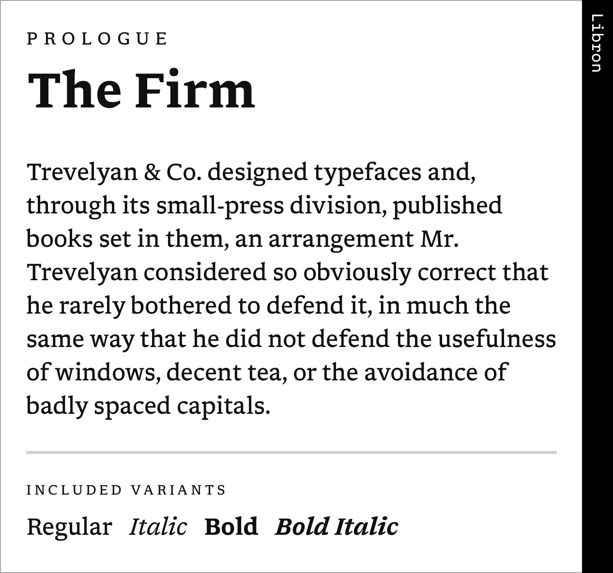

**Libron** is a modified version of [Readerly](https://github.com/nicoverbruggen/readerly) with various manual edits to give the font a more neutral look. The serifs have been trimmed down on several capitals, certain glyphs have been reworked, and composite glyphs have been fixed. The result is a more understated serif that is less visually "loud" during extended reading sessions. A [separate repository](https://github.com/nicoverbruggen/libron) is available with the source files.

> [Libron](https://github.com/nicoverbruggen/libron) is a modified font based on Newsreader, designed by Production Type and has been manually modified for an even better reading experience. Libron is available under the [OFL license](https://openfontlicense.org/).

_**Nico's Note**: Libron is my current favorite for digital reading: it keeps the readability of Readerly but refines the serifs for a more subtle appearance on e-ink, while still retaining an increased weight for optimal contrast._

### Sourcerer

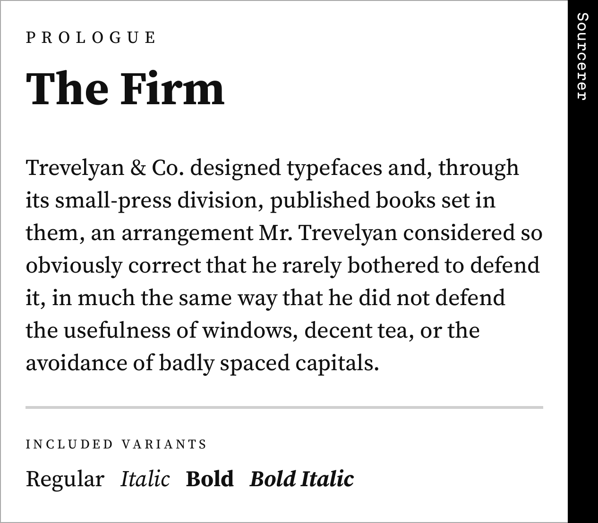

**Sourcerer** is a thicker version of [Source Serif 4](https://github.com/adobe-fonts/source-serif) with 20% spacing, and has been renamed so it works correctly on Kobo devices (as fonts containing a number will often not work). It is available under the [OFL license](https://openfontlicense.org/).

> [Source Serif](https://github.com/adobe-fonts/source-serif/wiki/Source-Serif-Readme) continues Adobe’s line of high-quality open source typefaces. Designed for a digital environment, the letter shapes are simplified and highly readable. Its historical roots, combined with expert guidance give the typeface a strong character of its own that will shine when used for extended text on paper or screen.

_**Nico's Note**: This is a heavier take on Source Serif, which I've found nicer to read on e-ink displays than the original._

### Cartisse

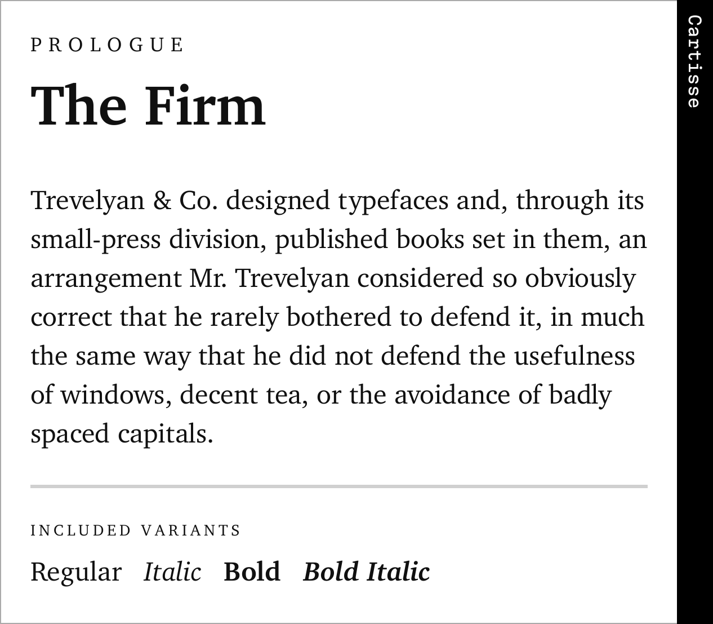

**Cartisse** is a modified version of [XCharter](https://www.ctan.org/tex-archive/fonts/xcharter/), which is an extended version of [Bitstream Charter](https://en.wikipedia.org/wiki/Bitstream_Charter). This modified version has a [dedicated repository](https://github.com/nicoverbruggen/cartisse) that I've linked since it does contain some manual modifications to kerning specifically made for optimal legibility and appearance on Kobo devices.

> Charter was designed by Matthew Carter in 1987 as a body text font that would hold up well on low-resolution output devices of the day—fax machines and 300 dpi laser printers. XCharter is a project by Michael Sharpe, which extends Bitstream's Charter. An extended copyright notice has been included as part of Cartisse.

_**Note**: Cartisse makes for a great universal pick for most books. It's my choice for a font that doesn't distract while remaining very easy to read._

### NV Charis

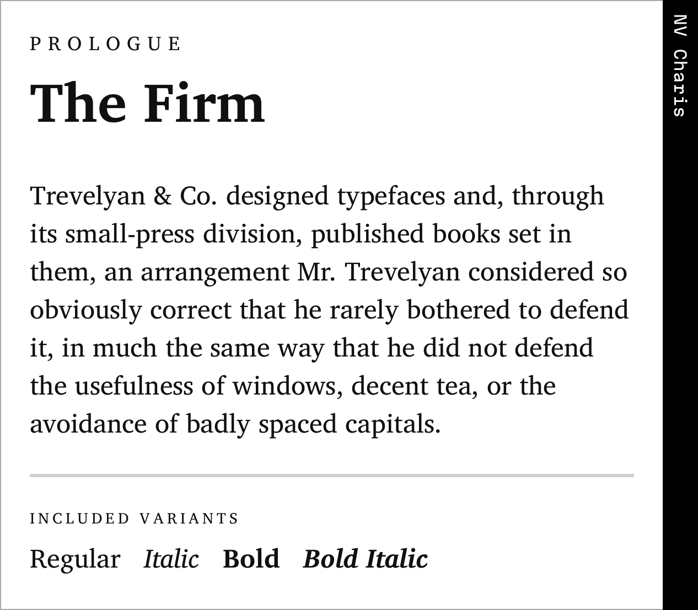

**NV Charis** is a version of [Charis 7.0](https://software.sil.org/charis/) by SIL with a slightly more narrow line-height. It is very similar to Charter, but under a more permissive license.

> Charis is very closely based on the design of Bitstream Charter. [...] The glyphs were completely redrawn based only on visual reference to Charter. There are some significant design differences in the serif structure, proportions, diacritics, and Cyrillic. The design was also adjusted and extended to cover a much wider range of characters and publishing needs. It is available under the [OFL license](https://openfontlicense.org/).

_**Note**: Charis is slightly thicker than Cartisse, and has broader language support. If that's what you need, you may want to pick it over Cartisse._

### NV Garamond

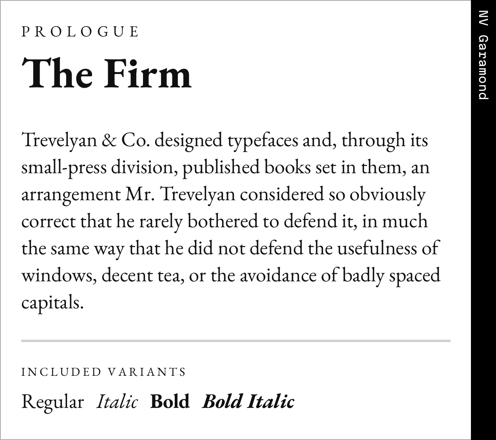

**NV Garamond** is an EB Garamond variant that contains a bunch of tweaks, mostly related to glyph sizes. This version is about 10% optically larger than EB Garamond, which, with an adjusted line height, makes it ideal for reading on Kobo devices. This version has a [dedicated repository](https://github.com/nicoverbruggen/nv-garamond) that I've linked because of the manual edits that I've made.

> You can also find the original version of EB Garamond [on Google Web Fonts](https://fonts.google.com/specimen/EB+Garamond/about). EB Garamond was designed by Octavio Pardo and Georg Duffner, and created as an open source revival of Claude Garamont's original design, based on the Berner specimen. You can learn more about the project [here](http://www.georgduffner.at/ebgaramond/). It is available under the [OFL license](https://openfontlicense.org/).

_**Nico's Note**: Various Garamond variants are commonly used when typesetting for printed books. If you're looking to emulate that feeling of a premium hardback of your favorite fantasy novel, this is the way to go!_

### NV Jost

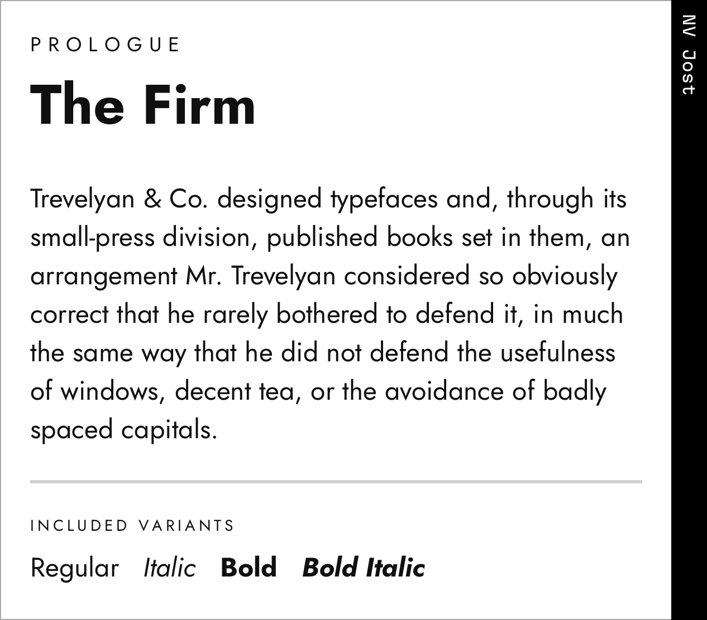

**NV Jost** is a Jost variant, with a slightly altered lowercase G and single storey a (similar to Futura, only accessible via OT feature on the original font). This one has a [dedicated repository](https://github.com/nicoverbruggen/nv-jost), mostly because I made some glyph alterations.

> You can find the original version of Jost [on Google Web Fonts](https://fonts.google.com/specimen/Jost/about). Jost was designed by Owen Earl of [indestructable type*](https://indestructibletype.com). It is available under the [OFL license](https://openfontlicense.org/).

_**Nico's Note**: If you're looking for something different, the sans-serif Jost is a great choice. If you're looking for a font that reminds you of [Futura](https://en.wikipedia.org/wiki/Futura_(typeface)), this is the one._

### NV Bitter

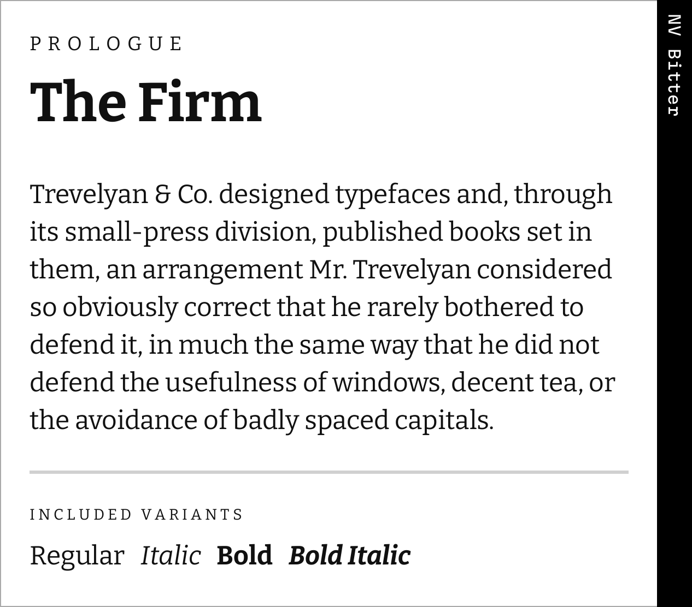

**NV Bitter** is a version of [Bitter](https://github.com/solmatas/BitterPro) that has been renamed, so it can be installed and loaded correctly on old and new Kobo devices. Newer devices may already include Bitter as part of the software, which is why this version has been renamed to avoid conflicts.

> You can find the original version of Bitter [on Google Web Fonts](https://fonts.google.com/specimen/Bitter/about). Bitter was designed by [Sol Matas](http://www.solmatas.com/), and available under the [OFL license](https://openfontlicense.org/).

_**Nico's Note**: Bitter is a gorgeous slab serif font. If you enjoyed Caecilia on other e-readers and it isn't available on your device, this may be a good alternative._

### NV Legible Next

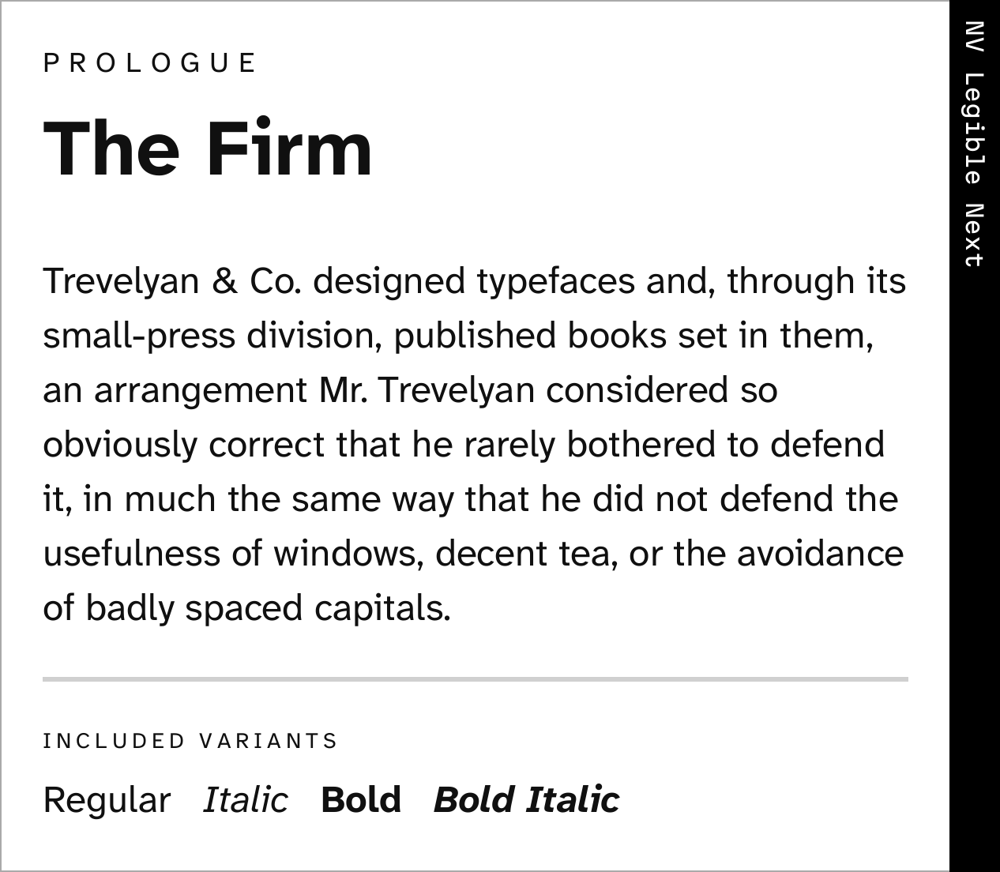

**NV Legible Next** is a variant of Atkinson Hyperlegible Next. This is a refined version of the original Atkinson Hyperlegible released in 2025. Because "Atkinson Hyperlegible Next" is a very long name, I decided to shorten it up a bit for your e-reader.

> You can find the original version of Atkinson Hyperlegible Next [on Google Web Fonts](https://fonts.google.com/specimen/Atkinson+Hyperlegible+Next/about). Designed by: Braille Institute, Applied Design Works, Elliott Scott, Megan Eiswerth, Letters From Sweden. Named after the founder of the Braille Institute, Atkinson Hyperlegible Next has been developed specifically to increase legibility for readers with low vision, and to improve reading comprehension.

_**Nico's Note**: The previous version of this font is included by default on newer Kobo devices, but I recommend using this version since it is newer; this is the "Hyperlegible Next" variant._

### NV Palatium

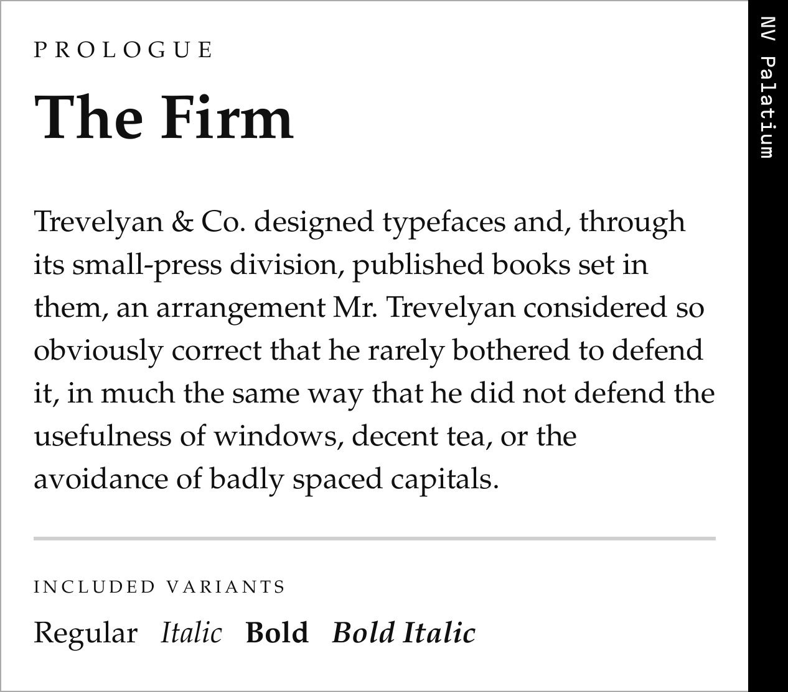

**NV Palatium**, is a renamed version of [Domitian](https://www.ctan.org/tex-archive/fonts/domitian/), which is an extended version of [URW Palladio](https://tug.org/FontCatalogue/urwpalladio/). This one has a [dedicated repository](https://github.com/nicoverbruggen/nv-palatium) that I've linked because I've expanded and updated the embedded license in each of the font files.

> You can find the original version of Domitian [on GitHub](https://github.com/dbenjaminmiller/domitian). Designed by: Hermann Zapf, Daniel Benjamin Miller. Domitian is a project to develop a full-featured, free and open-source implementation of Hermann Zapf's Palatino design. "Domitian" is in reference to builder of the Flavian Palace, located on the Palatine Hill. It is available under various licenses, including the [OFL license](https://openfontlicense.org/).

_**Nico's Note**: If you're looking for a font that reminds you of [Palatino](https://en.wikipedia.org/wiki/Palatino), you will find that Domitian is pretty much the open font equivalent of that classic typeface._

## Extra Collection

**These are additional fonts that I think you should try, as well!** You can check them out below or visit [the showcase](https://ebook-fonts.nicoverbruggen.be/).

### Readerly

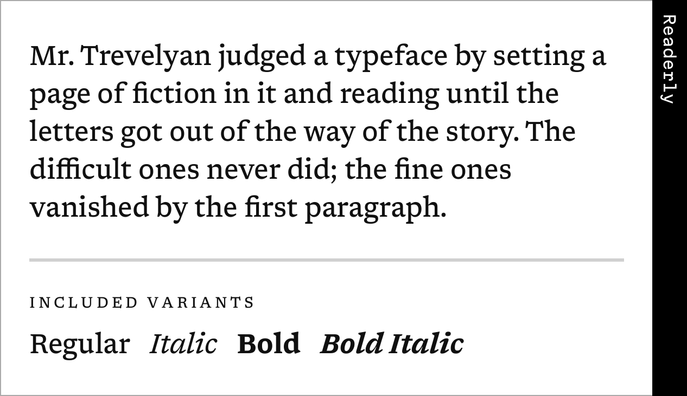

**Readerly** is a modified font based on [Newsreader (9pt)](https://github.com/productiontype/Newsreader), while attempting to be metrically very similar to [Bookerly](https://en.wikipedia.org/wiki/Bookerly). A [separate repository](https://github.com/nicoverbruggen/readerly) is available with the source files. OFL licensed. It has been superseded by _Libron_ in the Core Collection.

### NV Adelph

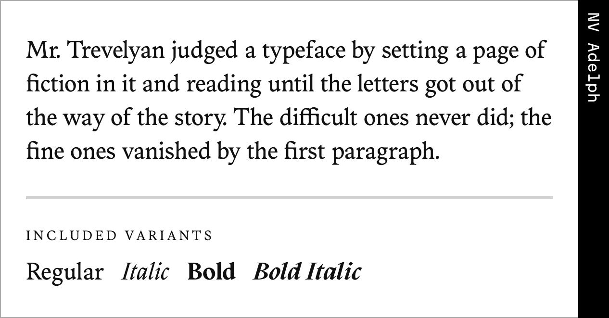

**NV Adelph** is a variant of the [Adelphe](https://gitlab.com/bye-bye-binary/adelphe). I've altered the metrics for adjusted line height. [OIFL licensed](https://typotheque.genderfluid.space/fr/licences), like the original. (If you're curious, this is in essence a more gender-inclusive version of the OFL, so you can use the font in the exact same way as any OFL-licensed font.)

### NV Alegreya

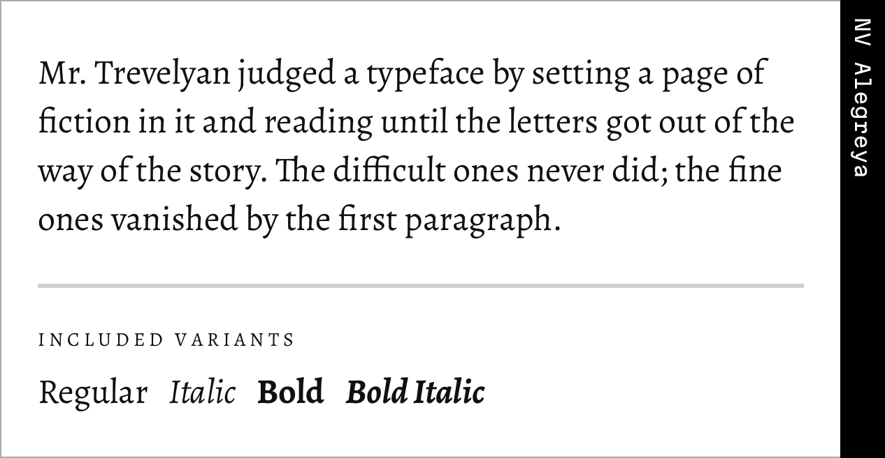

**NV Alegreya** is a variant of [Alegreya](https://github.com/huertatipografica/Alegreya) by Huerta Tipográfica, with adjusted metrics for line height. Like all fonts in this collection, its line height has been modified. OFL licensed.

### NV Alizar

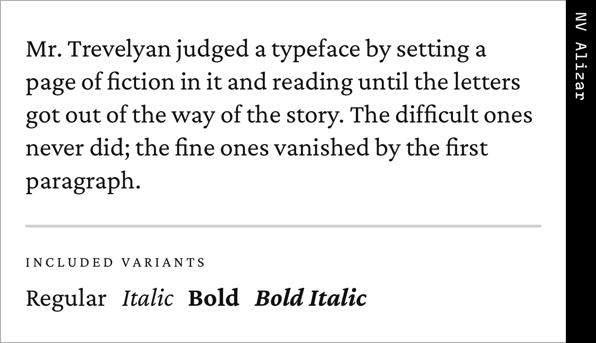

**NV Alizar** is a variant of [Crimson Pro](https://github.com/Fonthausen/CrimsonPro), with adjusted metrics for line height and a 12.6% glyph size increase, which puts it at exactly the same size as NV Scarlet. Crimson Pro is the modern redraw of the same Crimson that NV Scarlet comes from. OFL licensed.

### NV Ancizar Serif

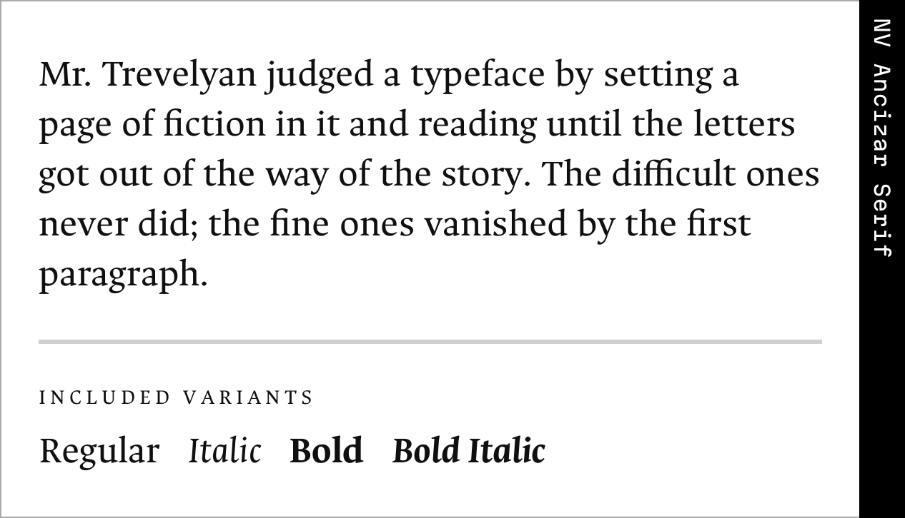

**NV Ancizar Serif** is a variant of [UNAL Ancizar Serif](https://github.com/UNAL-OMD/UNAL-Ancizar). I've altered the metrics for adjusted line height and increased the glyph scale by 8% so it sits more comfortably alongside the other serif fonts in this collection. OFL licensed.

### NV Ancizar Sans

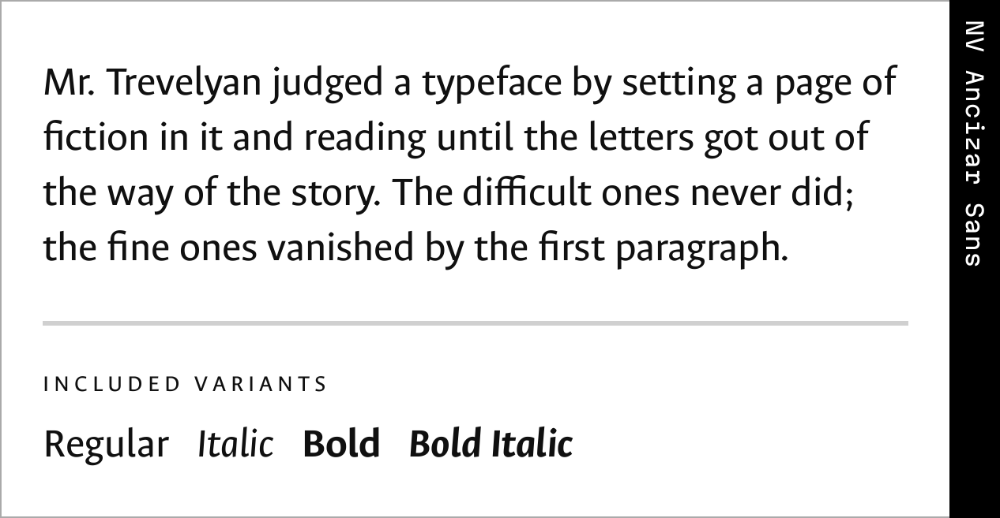

**NV Ancizar Sans** is a variant of [UNAL Ancizar Sans](https://github.com/UNAL-OMD/UNAL-Ancizar). I've altered the metrics for adjusted line height and increased the glyph scale by 8% so it sits more comfortably alongside the other fonts in this collection. Effectively the sans serif version of Ancizar Serif, as you might expect. OFL licensed.

### NV Andada


**NV Andada** is a variant of [Andada Pro](https://github.com/huertatipografica/Andada-Pro) by Huerta Tipográfica, with adjusted metrics for line height. OFL licensed.

### NV Basker

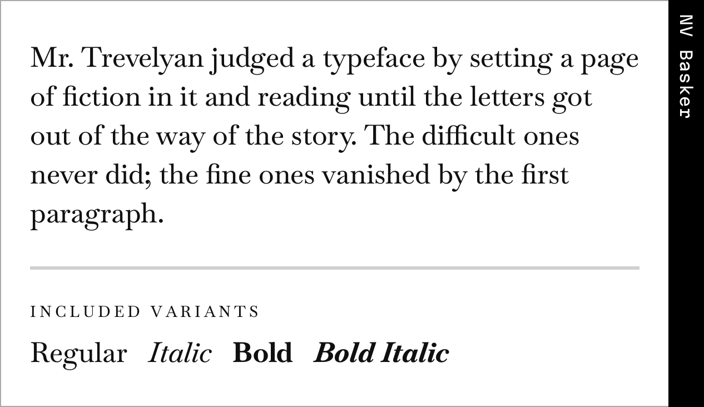

**NV Basker** is a variant of [ANRT-Baskervville](https://github.com/anrt-type/ANRT-Baskervville). I've altered the metrics for adjusted line height, and the medium weight is used for text, as opposed to the regular weight. OFL licensed.

### NV Cardo

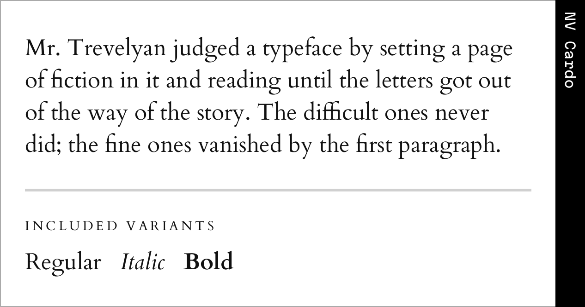

**NV Cardo** is a version of [Cardo](https://github.com/ryanfb/Cardo) with 20% spacing and has been renamed so you can keep the original Cardo installed side-by-side as well. Does not have a separate repository because no other changes were applied. OFL licensed.

### NV Castoro

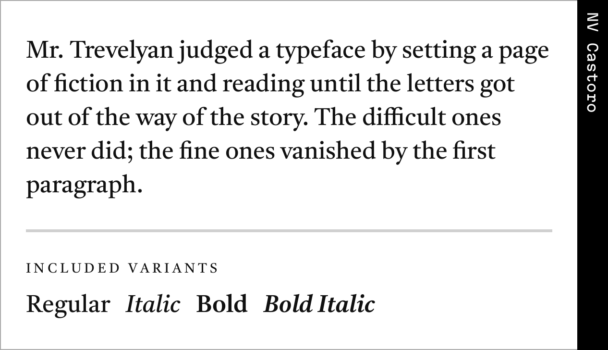

**NV Castoro** is a variant of [Castoro](https://github.com/TiroTypeworks/Castoro) by Tiro Typeworks, with adjusted metrics for line height. OFL licensed.

### NV Charis Literacy

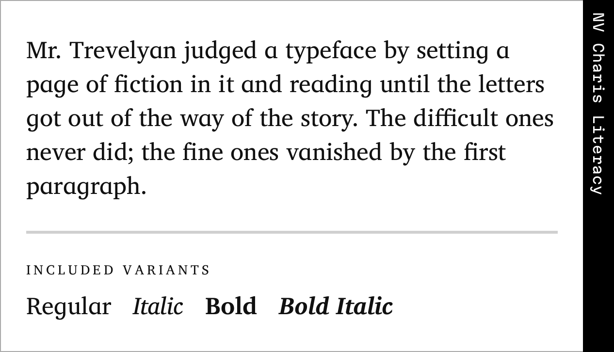

**NV Charis Literacy** is a version of [Charis 7.0](https://software.sil.org/charis/) by SIL with the "Single-story a and g" stylistic set baked in by default, which makes it a good pick for early readers or literacy contexts where simplified letterforms are easier to recognize. Like NV Charis, it has a slightly more narrow line-height. OFL licensed.

### NV Charis Old Style

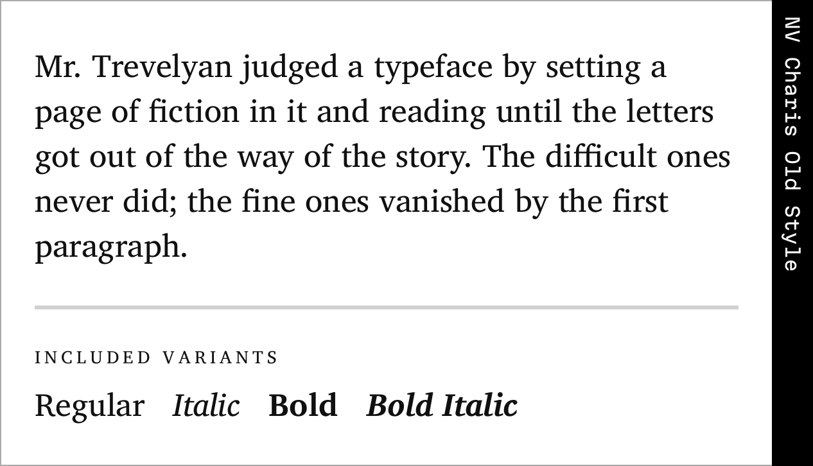

**NV Charis Old Style** is a version of [Charis 7.0](https://software.sil.org/charis/) by SIL with old-style (text) figures baked in by default, so numerals blend more naturally with lowercase text instead of standing at full cap-height. Like NV Charis, it has a slightly more narrow line-height. OFL licensed.

### NV Clara

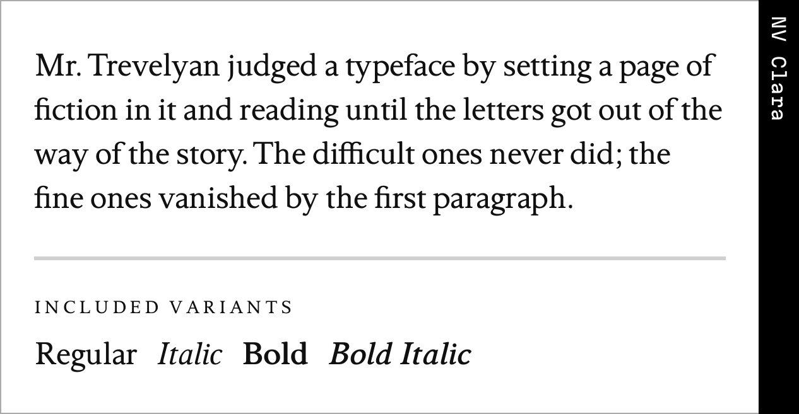

**NV Clara** is a version of [Clara](https://ctan.org/pkg/clara) by Séamas Ó Brógáin, with adjusted metrics and an 8% glyph scale increase for e-readers. OFL/GPL-with-font-exception licensed.

### NV Elstob

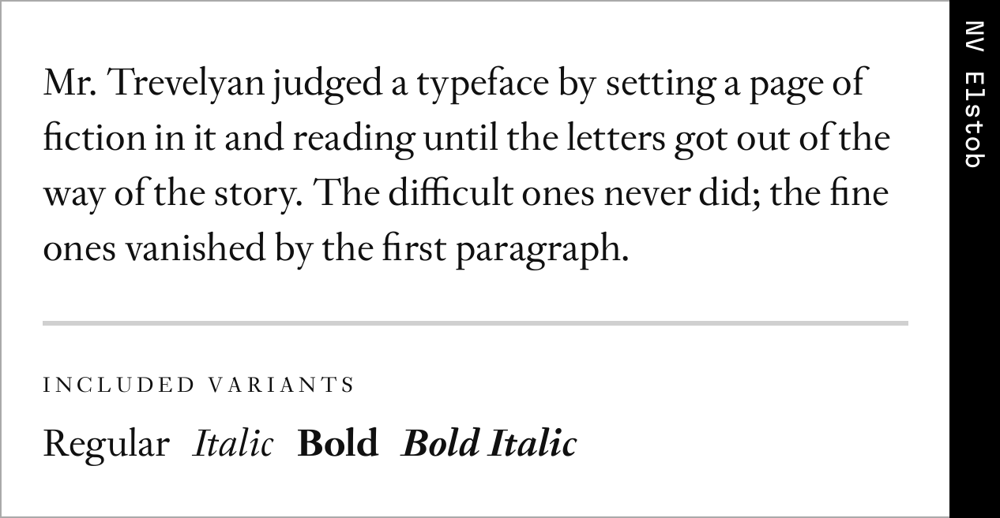

**NV Elstob** is a version of [Elstob](https://github.com/psb1558/Elstob-font) that has been renamed so it works correctly on Kobo devices. It is based on the 12pt version. Does not have a separate repository because no other changes were applied. OFL licensed.

### NV Erewhon

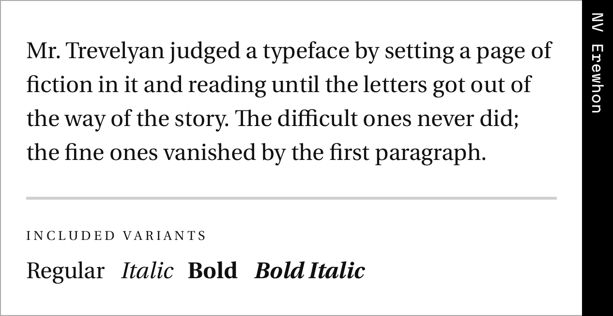

**NV Erewhon** is a version of [Erewhon](https://ctan.org/pkg/erewhon), derived from Heuristica and Utopia, with adjusted metrics for e-readers. OFL licensed.

### NV Gentium

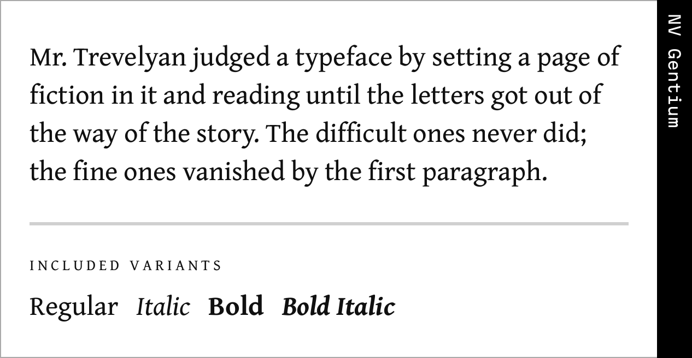

**NV Gentium** is a version of [Gentium](https://software.sil.org/gentium/) Book 7.0 with corrected PANOSE information for the Bold and Bold Italic weights, which was incorrect. This modified version ensures the font is displayed correctly on Kobo devices. OFL licensed.

### NV Georsio

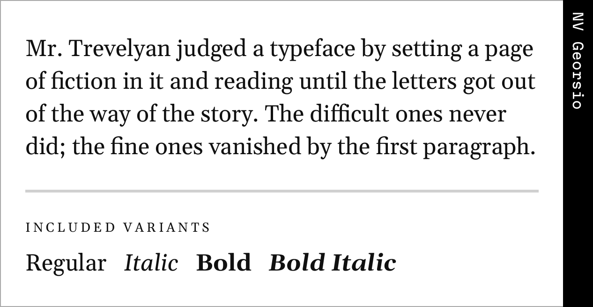

**NV Georsio** is a modified version of Gelasio, which was created to have identical metrics to Georgia, one of the [web's core fonts](https://en.wikipedia.org/wiki/Core_fonts_for_the_Web) thanks to Microsoft making it available on pretty much every PC and Mac in the world. OFL licensed.

### NV Halcyon

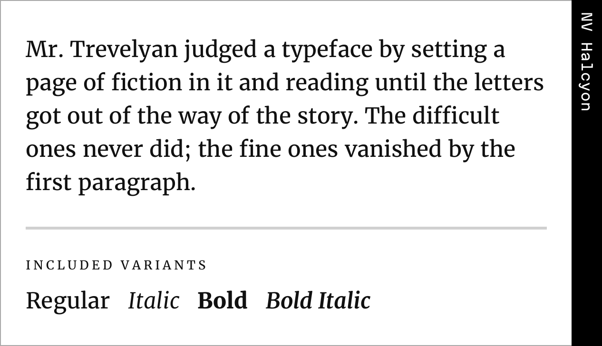

**NV Halcyon** is a variant of [Merriweather](https://github.com/SorkinType/Merriweather) by Eben Sorkin, with adjusted metrics for line height and the glyph scale reduced by 8%. A sturdy text face drawn to read well on screens, which serves E Ink nicely too. Merriweather's x-height is unusually large, so the reduction brings it into line with the rest of the collection. _Halcyon_ keeps the fair-weather sense of the original's name. OFL licensed.

### NV Ibarra

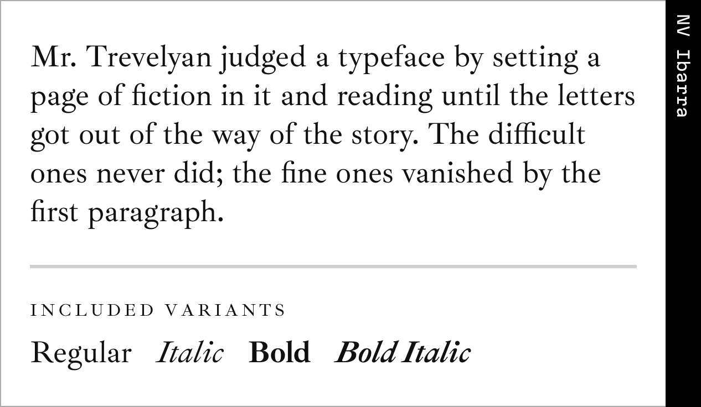

**NV Ibarra** is a variant of [Ibarra Real Nova](https://github.com/googlefonts/ibarrareal), with adjusted metrics for line height and an 11% glyph size increase, since it is drawn small. The text weight is instanced at 450 rather than 400, as the thin strokes would otherwise drop out on E Ink. OFL licensed.

### NV Junius

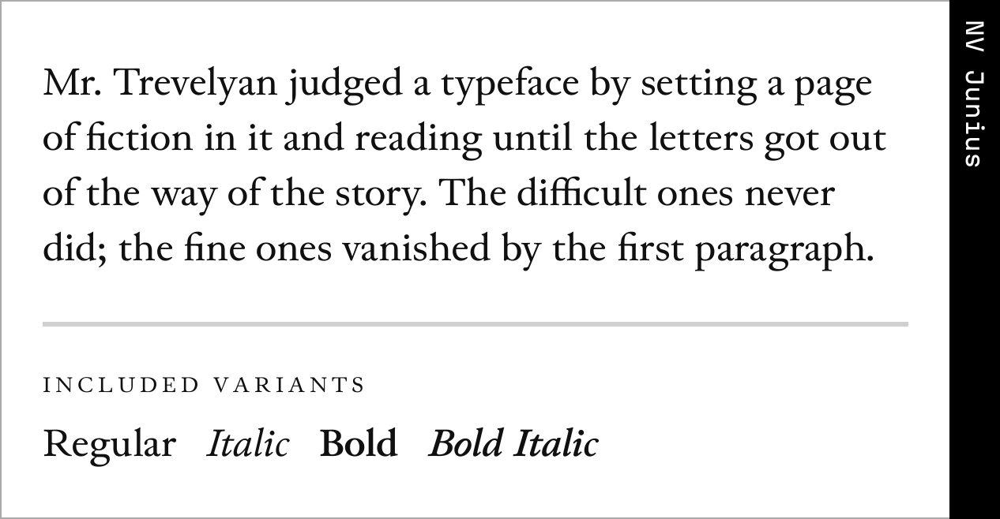

**NV Junius** is a [Junicode 2](https://github.com/psb1558/Junicode-font) variant based on the variable font, with adjusted metrics and a 10% glyph size increase. This one does not have a repository, but can be easily recreated by using [Slice](https://github.com/source-foundry/Slice), a GUI that allows you to export various fixed configurations. OFL licensed.

### NV Kierkegaard

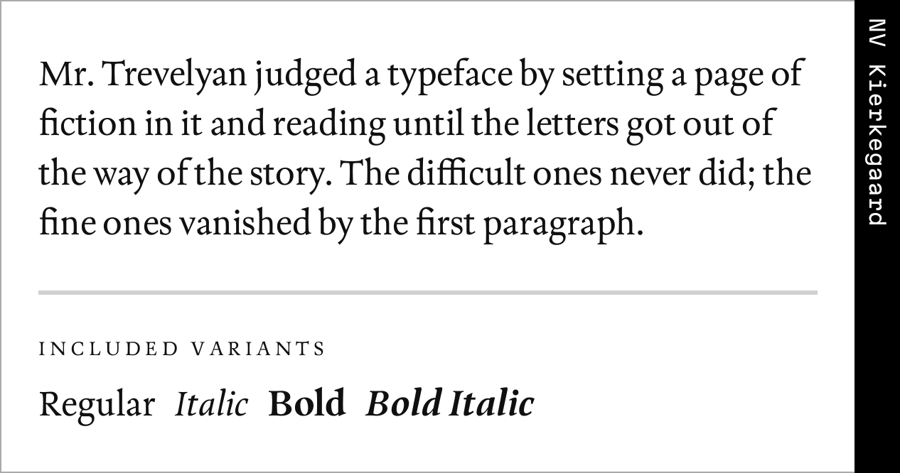

**NV Kierkegaard** is a renamed version of [Kierkegaard Text](https://github.com/jrgdrs/Kierkegaard) by Jörg Drees, with adjusted metrics for e-readers and a 9% glyph size increase, since it is drawn small. OFL licensed.

### NV Libertinus

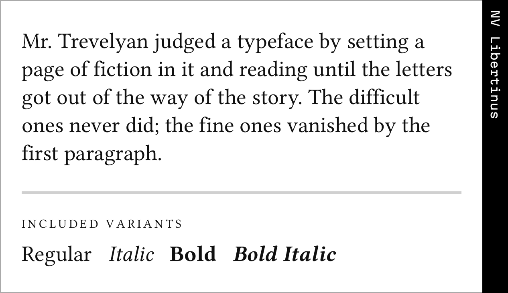

**NV Libertinus** is a variant of [Libertinus](https://github.com/alerque/libertinus) Serif. I've altered the metrics for adjusted line height and increased the glyph scale by 11%, since it is drawn small and would otherwise read a size down from the rest of the collection. OFL licensed.

### NV Literata

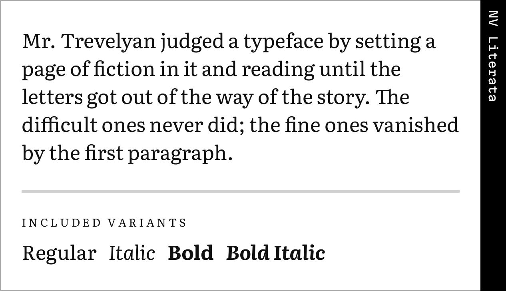

**NV Literata** is a variant of [Literata](https://github.com/googlefonts/literata) with some adjusted metrics and has been renamed so it works correctly on Kobo devices. OFL licensed.

### NV Membo

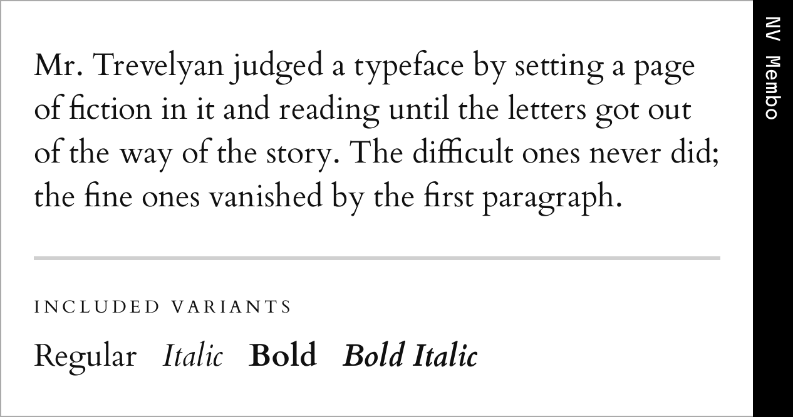

**NV Membo** is a renamed version of [fbb](https://www.ctan.org/tex-archive/fonts/fbb), a modified version of Cardo which has a Bold Italic style, unlike NV Cardo. It has been converted to TrueType (`ttf`) for better Kobo compatibility. OFL licensed.

### NV Newsreader

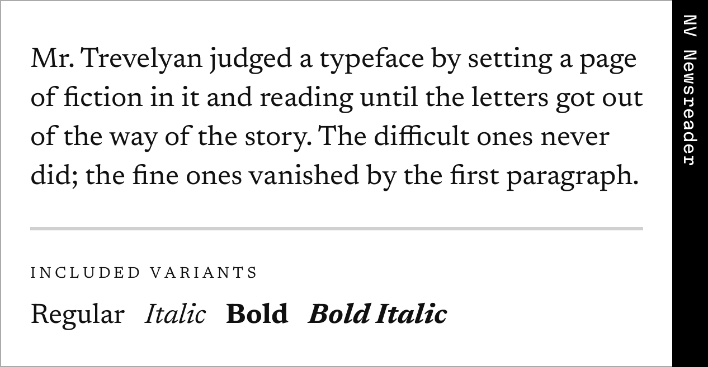

**NV Newsreader** is a variant of [Newsreader](https://fonts.google.com/specimen/Newsreader). Based on the 14pt optical variant, which makes it great for e-reading at larger font sizes. OFL licensed.

### NV NinePoint

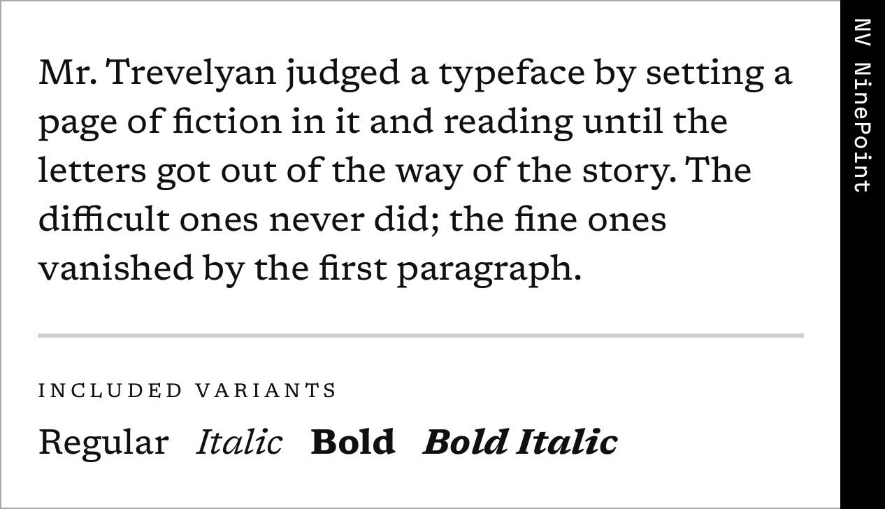

**NV NinePoint** is a variant of [Newsreader](https://fonts.google.com/specimen/Newsreader), based on the 9pt optical variant. This makes it a very good choice for those who want maximum readability at smaller font sizes. In order to ensure it loads correctly on Kobo devices, and in order to avoid confusion with the other version of Newsreader included in this repository, the font has been renamed to _NinePoint_. OFL licensed.

### NV Publica

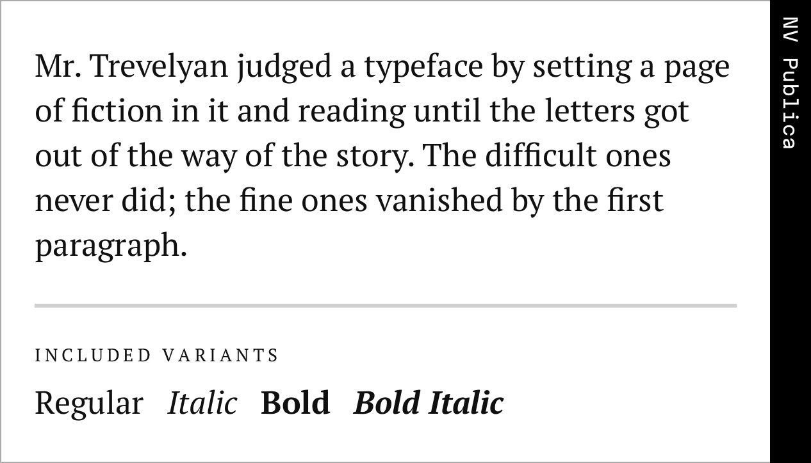

**NV Publica** is a variant of [PT Serif](https://www.paratype.com/fonts/pt/pt-serif) by ParaType, with adjusted metrics for line height. A sturdy, low-contrast transitional face drawn for both screen and print, with broad Latin and Cyrillic coverage. The _PT_ is usually read as _public type_, after the Russian public-types programme it was made for, which _Publica_ keeps. OFL licensed.

### NV Publica Wide

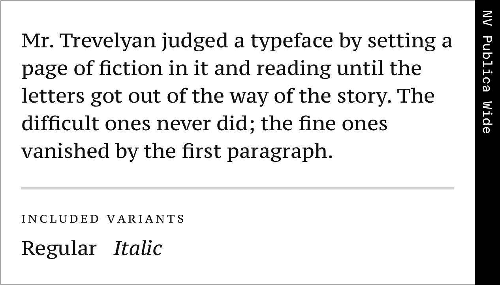

**NV Publica Wide** is a variant of [PT Serif Caption](https://www.paratype.com/fonts/pt/pt-serif) by ParaType, with adjusted metrics for line height. The _caption_ optical size of the same design as NV Publica: drawn for small text, so it is sturdier and about 13% wider per character. It is named _Wide_ rather than _Caption_ because that is what it does to your page: expect fewer words per line, not more. ParaType never drew a bold for this cut, so only Regular and Italic exist. OFL licensed.

### NV Sable


**NV Sable** is a variant of [Lora](https://github.com/cyrealtype/Lora-Cyrillic) by Cyreal, with adjusted metrics for line height. A contemporary serif with calligraphic roots, so its curves have a brushed quality that gives a page a bit more movement than the quieter faces here. Named for the sable brush those strokes recall, since Cyreal reserve the name _Lora_ for their own releases. OFL licensed.

### NV Scarlet

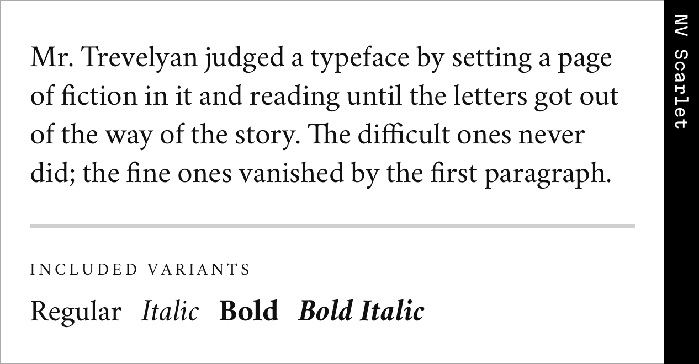

**NV Scarlet** is a variant of [Cochineal](https://ctan.org/pkg/cochineal), with adjusted metrics for line height and a 10% glyph size increase so it reads at the same size as before. Cochineal is Michael Sharpe's extension of [Crimson](https://github.com/skosch/Crimson) by Sebastian Kosch, which earlier releases of NV Scarlet were based on, adding over 1500 glyphs: real small caps, old-style and lining figures, fractions, and Greek and Cyrillic. An oldstyle garalde at heart, closer to Minion Pro than to the more modern Crimson Pro. Cochineal, as it happens, is the insect that scarlet dye is made from. OFL licensed.

### NV Tabula

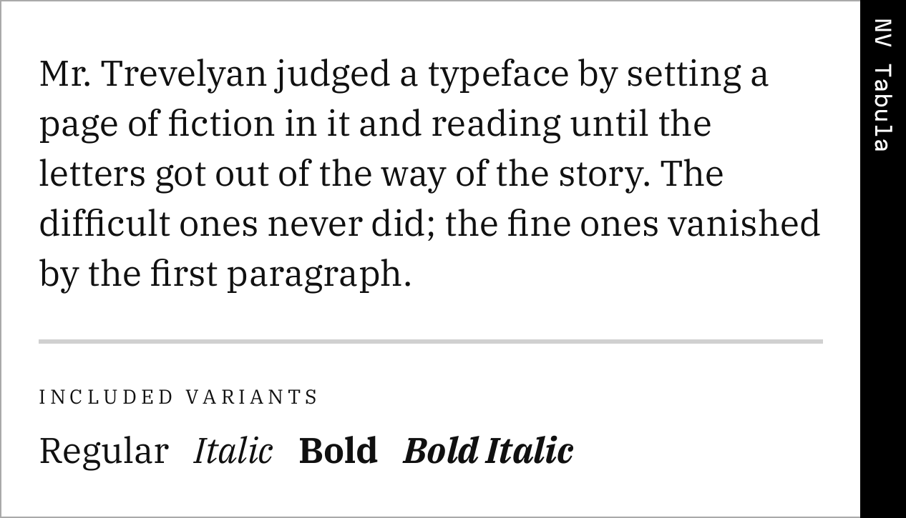

**NV Tabula** is a variant of [IBM Plex Serif](https://github.com/IBM/plex), with adjusted metrics for line height. A transitional serif with a large x-height and an even, faintly mechanical colour that holds up well on E Ink. Named after the Tabulating Machine Company that IBM grew out of, and for _tabula_, the writing tablet. OFL licensed.

### NV Technical

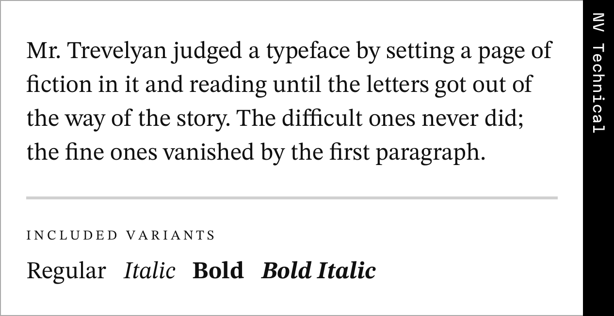

**NV Technical** is a variant of [STIX Two Text](https://fonts.google.com/specimen/STIX+Two+Text/about). OFL licensed. If you use a Kobo that has stylus support, STIX Two Text will likely already be included on your device, and in that case you probably don't need to install this version.

### NV Yrsa

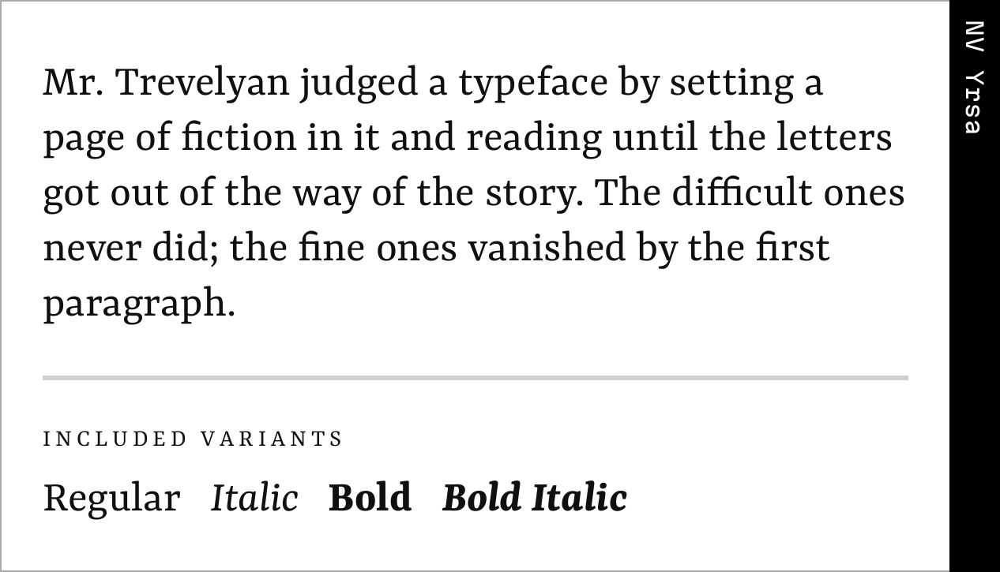

**NV Yrsa** is a variant of [Yrsa](https://github.com/rosettatype/yrsa-rasa) by Rosetta Type, with adjusted metrics for line height and a 15% glyph size increase. Yrsa is the Latin half of the Yrsa/Rasa superfamily, drawn to sit alongside Gujarati, which is why it comes out small. Scaled up for Latin-only reading it is low-contrast and even-textured, and holds together well on E Ink. OFL licensed.

### NV Zilla Slab

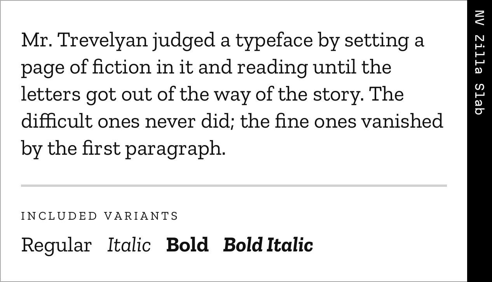

**NV Zilla Slab** is a [Zilla Slab](https://github.com/mozilla/zilla-slab) variant, with adjusted metrics and a 10% glyph size increase. This makes it ideal for digital reading on e-readers. This one has a [dedicated repository](https://github.com/nicoverbruggen/nv-zilla-slab) that I've linked, OFL licensed.

### NV Disleksio

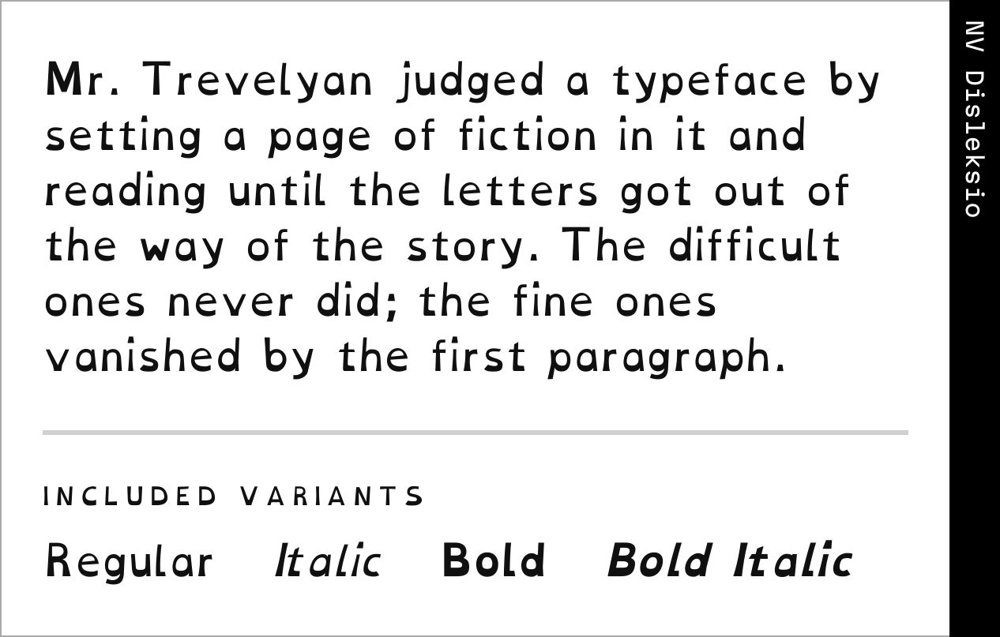

**NV Disleksio** is a variant of [OpenDyslexic](https://forge.hackers.town/antijingoist/opendyslexic), based on experiments made on v0.99 of the original in [this repository](https://github.com/nicoverbruggen/odys-compare). OFL licensed. (This revision replaces the original *NV OpenDyslexic* that used to ship with this collection.)

## How to install

To install these fonts on your Kobo, unzip the files and drag the font files into the `fonts` directory at the root of your Kobo device after connecting your Kobo to your PC via USB cable. You may need to create the `fonts` directory. Drag the `.ttf` and `.otf` files into the `fonts` directory, do not use subfolders.

**I recommend rebooting your Kobo after installing the fonts to make sure they work correctly. A reboot is REQUIRED if you already had other versions of these fonts installed on your device, or the new versions won't be used.**

To reboot, long-press the power button until your Kobo says it has been shut down. Then, press the power button again and wait for your device to restart.

## FAQ

### Where can I download these fonts?

The fonts are available via the [releases section](https://github.com/nicoverbruggen/ebook-fonts/releases) on GitHub. Take care to pick the right release for your device!

### Why did you alter these fonts?

Please go take a look at my blog post, [Patching Fonts for my Kobo](https://nicoverbruggen.be/blog/patching-fonts-for-kobo). It's part of a series of posts related to customizing fonts for the most optimal (subjective) e-reading experience. 

This is the first post in a series, so there may more recent entries!

### What tweaks have been applied to these fonts?

All of the **fonts have been adjusted in various ways**, and the names of the fonts are also different. Sometimes only a prefix has been added, but sometimes the font name has been totally changed, although I've attributed the original and their authors, of course.

This way, you can keep them installed side-by-side with the original versions, if you'd like. This is also a requirement of the Open Font License, which does not allow you to redistribute the fonts using the original name if they have been altered.

All of the fonts have been standardized with the "NV" preset of [kobo-font-fix](https://github.com/nicoverbruggen/kobo-font-fix), which applies the following changes automatically. (The fonts with their own name, such as Libron and Cartisse, keep that name instead of getting an NV prefix.)

- **Metrics are normalized** for all fonts to a **20% line height** (via `font-line percent 20`). Some fonts rendered poorly on Kobo devices with the line height slider all the way to the left. This fixes that.
- Incorrect **PANOSE metadata is corrected** where necessary. This ensures that the fonts render correctly on Kobo devices. For some fonts, incorrect information meant that the fonts would always render using their Bold style, for example.
- Certain fonts have had their **glyphs rescaled**. Fonts that are drawn optically small have had their glyph sizes increased, making them more consistent in size with the other fonts included in this collection. If you like to stick to a certain font size, you won't need to constantly tweak things if you swap to a different font.
- **Missing space and dash characters are filled in** (such as the thin space, narrow no-break space, soft hyphen and non-breaking hyphen). Books do use these, and if a font doesn't include them, you get a "missing character" box on your e-reader.

### What has changed with the KF fonts?

The **Kobo Fix (KF)** versions of the fonts are optimized for Kobo devices. Please use these if you are reading on a Kobo e-reader!

These are built with the "KF" preset of the same [kobo-font-fix](https://github.com/nicoverbruggen/kobo-font-fix) tool, which applies additional fixes on top of the standardized fonts: a legacy `kern` table is generated for improved kerning in the `kepub` renderer, and hinting adjustments prevent the vertical "wobble" that Kobo's rasterizer otherwise introduces.

### Are these fonts free?

Yes, they are totally free.

### Can I put these fonts in my own eBooks (via embedding)?

Yes, you can embed them, just make sure you include the license of the font in the book.

### Are these fonts installable via KoboPatch Web UI?

Yes, some are included. 

However, the fonts may be outdated on the website, it may take a few days for the website to catch up. Some of these fonts are currently included as a default option in [KoboPatch Web UI](https://kp.nicoverbruggen.be/) for the NickelMenu preset.

You can verify they get installed by making sure the "Install additional fonts" option is checked. If you want to install the rest of the fonts from this collection, you will need to do so manually.

### What's up with the scripts?

Besides the build script, the helper scripts under `tools/` download the pinned fonts from their upstream repositories, stamp metadata, and generate the release manifest.

The example images in this README are also scripted: `./tools/generate_examples.sh` re-renders every image under `examples/` from the fonts on disk, so updating a font only takes a re-run to refresh its picture.

### How are these fonts licensed?

Most of these fonts are available under their original [Open Font License](https://openfontlicense.org/). Because of licensing rules, the font names have been modified to include a prefix to avoid confusion with the original fonts. The license for each font is listed below each listing, as well.

### Is there anything else I should do, to get a better reading experience with these fonts?

If you are manually transferring books to your Kobo devices, you should consider converting `epub` files to `kepub` files. 

To do this, you can use [kepubify](https://pgaskin.net/kepubify/) or use [Calibre](https://calibre-ebook.com/). This ensures that your Kobo device will use a superior and faster book renderer. This renderer also gives you broader font compatibility.

### What version of the Kobo operating system did you last test the fonts with?

The last release was tested on a Kobo Libra Color running firmware version 4.45 and on a Kobo Libra 2 running version firmware 4.38.

The example images you see above are not device screenshots: they are rendered directly from the font files in this repository (at the width of a Kobo Libra Color screen, and without font hinting, since Kobo does not apply hinting either), so they always match the fonts as currently shipped. They can be regenerated with `./tools/generate_examples.sh`.

### Can I do anything else to fix or improve text rendering on Kobo devices?

**You can install my [KoboTypeFix](https://github.com/nicoverbruggen/KoboTypeFix) mod.** It fixes a few bugs with this rendering mode, and effectively gives you the best possible text reading experience.

**To get the best experience with this mod, you should turn on `optimizedLegibility`.** Like when transferring the fonts, you will need to connect your e-reader to your computer and modify `.kobo/Kobo/Kobo eReader.conf`.

It's a file located in a hidden folder on your Kobo device, so you may need to toggle "show hidden files" in whatever file manager you use.

You can add an override for `webkitTextRenderer`, but this WILL have some unexpected results if you like reading with fully justified text (the default setting).

Somewhere in that file, you should be able to find a `[Reading]` heading. Simply paste the instruction below:

```
[Reading] # add the next line, below this line!
webkitTextRendering=optimizeLegibility
```

Then, fully restart your Kobo device. You can be on the lookout for words containing `fi` or `ff`, which are commonly used ligatures, and present in fonts like NV Garamond and Libron.

> [!TIP]
> If you use [KoboPatch Web UI](https://kp.nicoverbruggen.be/) to install the NickelMenu preset, you can select **Enable better typography**, and it will adjust this for you.

### Why were some of the font names altered?

Because I thought it would be fun, and to avoid confusion with the original versions of the fonts. It's also legally required.

### Why did your prefix the fonts with "NV" or "KF"?

Well, those are my initials... also, I like to think of the prefix to mean "Nice Version" or "Nico's Version". I have also modified the font names where necessary. 

(The alternate variants for Kobo devices are prefixed with "KF", meaning "Kobo Fixed". If you use a stock Kobo without the `webkitTextRendering` override -- see above -- these are the ones you want.)

I initially suffixed each of the fonts with "eBook", but I wanted to have shorter font names for display purposes on smaller e-ink devices.

### What is your favorite font from the collection?

_Libron_ is my new favorite, but I am _very_ biased.

### Are the modified fonts' copyright messages updated?

Yes, but I should note that this doesn't change the actual licensing.  The release build (`build.py`) appends a short dated notice to each NV font's copyright string (Name ID 0) pointing back at this repository.

The original copyright is preserved verbatim above it, as required by the OFL. This stamp is only added to make it easier to determine when a font was generated.

### Do you have any other recommendations other than installing these fonts?

I recommend checking out [KOReader](https://koreader.rocks/), as you may find it more to your taste than the built-in reader on your e-reader.

It's the most configurable reading software I know, with excellent font rendering and incredible customization options. It's available for almost all devices you can think of. If the built-in reader isn't cool enough... go ahead.

### I have an idea for a font that could be included?

There's a few requirements before the font can be included:

- The font must be licensed under the OFL license
- The font must be visually distinct from the already included fonts
- The font should be generally acceptable for print publishing, too
- I must like the font (this is a _curated_ collection!)

Suggestions of _newly released_ OFL fonts are definitely welcome.

### I've discovered a problem with one of the fonts. What should I do?

If you're having an issue you think I can fix, please get [in touch](mailto:mail@nicoverbruggen.be) with me and let me know what the issue is. I may be able to help.

It is possible that certain issues are resolved by updating the fonts with the upstream version, which may need to happen every now and then.
