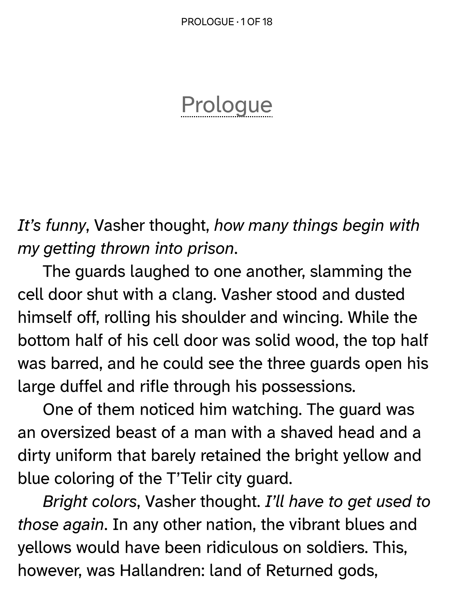

# Modified fonts for e-reading

This is a selection of fonts that I've tweaked for reading purposes on Kobo devices. These fonts can also be used other devices, including Kindle, Pocketbook, and may also work well for general use (i.e. word processing).

> [!IMPORTANT]
> **If you found these fonts useful, please consider starring the repository**, it helps me understand how useful my work has been.

## What is this?

This is a repository that includes various fonts that have been altered in some minor way for better compatibility with e-readers.

For some fonts, font family names have been altered, sometimes glyphs have been altered, sometimes metrics have been altered, all to improve the readability on E Ink displays.

The main use of these fonts is for usage on an e-reader. I've only selected and altered fonts that I have the rights to alter because of their license (e.g. free/libre license or equivalent).

These alterations were made for my own personal use, but I figure these fonts may be of use to others, so I make them available here. While font names have been changed and this is allowed due to the licensing of each of the source fonts, I have not modified any copyright messages included in the font files and included attribution to the original authors in the document below.

If you're curious, you can learn more about how and why I originally made these tweaked fonts on my website: [Patching Fonts for my Kobo](https://nicoverbruggen.be/blog/patching-fonts-for-kobo). I explain there how this repository came to be.

## Core fonts

### NV Baskerwil

<kbd></kbd>

 **NV Baskerwil** is a version of [Baskervville](https://github.com/anrt-type/ANRT-Baskervville) that was extracted from the  so it works correctly on Kobo devices. For optimal readability, the Regular and Italic fonts are using a weight of 500 instead of 400.

_You can also find the original version of Baskervville [on Google Web Fonts](https://fonts.google.com/specimen/Baskervville/about). Baskervville was designed by the ANRT students from 2017 (Alexis Faudot, Rémi Forte, Morgane Pierson, Rafael Ribas, Tanguy Vanlaeys and Rosalie Wagner), under the direction of Charles Mazé and Thomas Huot-Marchand. It is available under the [OFL license](https://openfontlicense.org/)._

### NV Bitter

<kbd></kbd>

 **NV Bitter** is a version of [Bitter](https://github.com/solmatas/BitterPro) that has been renamed so it works correctly on Kobo devices.

_You can also find the original version of Bitter [on Google Web Fonts](https://fonts.google.com/specimen/Bitter/about). Bitter was designed by [Sol Matas](http://www.solmatas.com/), and available under the [OFL license](https://openfontlicense.org/)._

**Note:** This font is included by default on newer Kobo devices. On older Kobo devices, like the Kobo Libra 2, it is not available without installing this version. Because this font has a different name, you can install it and it will co-exist alongside the included system font on newer devices.

### NV Garamond

<kbd></kbd>

 **NV Garamond** is an EB Garamond version that contains a bunch of tweaks, mostly related to glyph sizes. This version is about 10% optically larger than EB Garamond, which, with an adjusted line height, makes it ideal for reading on Kobo devices. This version has a [dedicated repository](https://github.com/nicoverbruggen/nv-garamond) that I've linked because of the manual edits that I've made.

 _You can also find the original version of EB Garamond [on Google Web Fonts](https://fonts.google.com/specimen/EB+Garamond/about). EB Garamond was designed by Octavio Pardo and Georg Duffner, and created as an open source revival of Claude Garamont's original design, based on the Berner specimen. You can learn more about the project [here](http://www.georgduffner.at/ebgaramond/). It is available under the [OFL license](https://openfontlicense.org/)._

 ---

> **TODO**: All font descriptions below should be updated and contain links to the original source and attribution. Fonts that are already present on Kobo devices should also have the same note as NV Bitter below them.

---

 ### NV Georsio

<kbd></kbd>

**NV Georsio** is a modified version of Gelasio.

### NV Jost

<kbd></kbd>

**NV Jost** is a Jost variant, with a slightly altered lowercase G and single storey a (similar to Futura, only accessible via OT feature on the original font). This one has a [dedicated repository](https://github.com/nicoverbruggen/nv-jost) that I've linked, OFL licensed.

### NV Legible

<kbd></kbd>

**NV Legible** is a variant of Atkinson Hyperlegible Next.

### NV Palatium

<kbd></kbd>

**NV Palatium**, is a renamed version of [Domitian](https://www.ctan.org/tex-archive/fonts/domitian/), which is an extended version of [URW Palladio](https://tug.org/FontCatalogue/urwpalladio/). This one has a [dedicated repository](https://github.com/nicoverbruggen/nv-palatium) that I've linked. Available under a [Free license](https://github.com/nicoverbruggen/nv-palatium/blob/main/LICENSE).

## Extra fonts

Also included are a set of extra fonts. Because this list could potentially grow, I do not have screenshots for each and every one of them.

- **NV Cardo** is a version of [Cardo](https://github.com/ryanfb/Cardo) with 20% spacing and has been renamed so you can keep the original Cardo installed side-by-side as well. Does not have a separate repository because no other changes were applied. OFL licensed.

- **NV Charis** is a version of Charis 7.0 with a slightly more narrow line-height.

- **NV Cooper** is a renamed version of [Cooper](https://indestructibletype.com/Cooper/).

-  **NV Elstob** is a version of [Elstob](https://github.com/psb1558/Elstob-font) that has been renamed so it works correctly on Kobo devices. It is based on the 12pt version. Does not have a separate repository because no other changes were applied. OFL licensed.

- **NV Gentium** is a version of Gentium Book 7.0 with corrected PANOSE information for the Bold and Bold Italic weights. This ensures the font is displayed correctly on Kobo devices.

-  **NV Junius** is a [Junicode 2](https://github.com/psb1558/Junicode-font) variant based on the variable font, with adjusted metrics and a 10% glyph size increase. This one does not have a repository, but can be easily recreated by using [Slice](https://github.com/source-foundry/Slice), a GUI that allows you to export various fixed configurations.

-  **NV Libertinus** is a variant of Libertinus Serif.

-  **NV Newsreader** is a variant of Newsreader.

-  **NV Source Serif** is a version of [Source Serif 4](https://github.com/adobe-fonts/source-serif) with 20% spacing and has been renamed so it works correctly on Kobo devices. Does not have a separate repository because no other changes were applied. OFL licensed.

-  **NV Technical** is a variant of STIX Two Text. (If you use a Kobo that has stylus support, STIX Two Text will be included on your device.)

## How to install

To install these fonts on your Kobo, unzip the files and drag the font files into the `fonts` directory at the root of your Kobo device after connecting your Kobo to your PC via USB cable. You may need to create the `fonts` directory.

**I recommend rebooting your Kobo after installing the fonts to make sure they work correctly. A reboot is REQUIRED if you already had other versions of these fonts installed on your device, or the new versions won't be used.**

To reboot, long-press the power button until your Kobo says it has been shut down. Then, press the power button again and wait for your device to restart.

## FAQ

### Where can I download these fonts?

The fonts are available via the [releases section](https://github.com/nicoverbruggen/ebook-fonts/releases) on GitHub.

### Why did you alter these fonts?

Please go take a look at my blog post, [Patching Fonts for my Kobo](https://nicoverbruggen.be/blog/patching-fonts-for-kobo). It's part of a series of posts related to customizing fonts for the most optimal (subjective) e-reading experience.

### Can I easily test these fonts to see what they look like?

I hope that the screenshots above do a good job at showing what they look like. If you want to further tune the fonts, you can do so in any book you have on your device, but I also provide a reference "book" you can download.

This document is called **Evaluating typefaces for electronic reading**, and contains markup to test various font styles and some more information about the included fonts. 

You can get the [Kobo epub](/docs/evaluating-typefaces.kepub.epub) or [regular epub](/docs/evaluating-typefaces.epub), which you should be able to copy to your e-reader.

### What tweaks have been applied to these fonts?

All of the **fonts have been renamed** (using [fontname.py](https://github.com/chrissimpkins/fontname.py)). This way, you can keep them installed side-by-side with the original versions, if you'd like. This is also a requirement of the Open Font License, which does not allow you to redistribute the fonts using the original name if they have been altered.

Some practical changes to the fonts themselves have been made, including:

- I've **normalized metrics** for all fonts to a **20% line height** (using `font-line percent 20`). Some fonts rendered poorly on Kobo devices with the line height slider all the way to the left. This fixes that!
- Incorrect **PANOSE information has been corrected** where necessary (using [panosifier](https://github.com/source-foundry/panosifier)). This ensures that the fonts render correctly on Kobo devices. For some fonts, incorrect information meant that the fonts would always render using their Bold style, for example.
- Certain fonts have had their **glyphs rescaled**. In particular, NV Junius and NV Garamond have had their glyph sizes increased by 10%, making them seem visually larger, and more consistent in size with the other fonts included in this collection. If you like to stick to a certain font size, you won't need to constantly tweak things if you swap to a different font.

### How are these fonts licensed?

Most of these fonts are available under their original [Open Font License](https://openfontlicense.org/). Because of licensing rules, the font names have been modified to include a prefix to avoid confusion with the original fonts. 

_NV Charter_ is available under the original Bitstream license. The original LICENSE file is embedded within my version of the fonts, and also included in the repository for legal reasons.

### Is there anything else I should do to to get a better reading experience with these fonts?

If you are manually transferring books to your Kobo devices, you should consider converting `epub` files to `kepub` files. 

To do this, you can use [kepubify](https://pgaskin.net/kepubify/) or use [Calibre](https://calibre-ebook.com/). This ensures that your Kobo device will use a superior and faster book renderer. This renderer also gives you broader font compatibility.

### What version of the Kobo operating system did you last test the fonts with?

The last release was tested on a Kobo Libra Color running firmware version 4.42 and on a Kobo Libra 2 running version firmware 4.38. The screenshots you see above were made on a Kobo Libra 2 running [NickelMenu](https://pgaskin.net/NickelMenu/) with [this configuration](https://github.com/nicoverbruggen/kobo-config).

### What is your favorite font from the collection?

_Charter_ is a timeless classic, so it is my preferred reading font.

### Why did your prefix the fonts with "NV"?

Well, those are my initials... also, I like to think of the prefix to mean "Nice Version" or "Nico's Version". (I initially suffixed them with "eBook" but I wanted to have shorter font names for display purposes on smaller e-ink devices.)

### In your original blog post, you made various fonts available. Where are those?

Included in the repository right now are only my tweaked fonts, which have all be prefixed with _NV_. However, [the older release](https://github.com/nicoverbruggen/ebook-fonts/releases/tag/v2024.03) may still be of interest as I've included my initial batch of tweaked fonts mentioned in [the blog post](https://nicoverbruggen.be/blog/patching-fonts-for-kobo) there.

### Why were some of the font names altered?

Some are easter eggs or fun references to the original name:

- Baskerwil because of Baskervil because of the [historical context](https://fonts.google.com/specimen/Baskervville/about) related to the revival of Baskervville
- Junius instead of Junicode because the latter actually a shorthand for "Junius-Unicode"
- Palatium as a reference to the Palatine hill in Italy, but it's the Roman name; I couldn't use Palatino and didn't want to use Palatine

### I've discovered a problem with one of the fonts. What should I do?

If you're having an issue you think I can fix, please get [in touch](mailto:mail@nicoverbruggen.be) with me and let me know what the issue is. I may be able to help.

It is possible that certain issues are resolved by updating the fonts with the upstream version, which may need to happen every now and then.