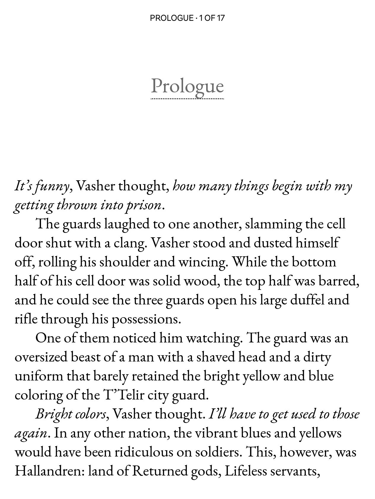
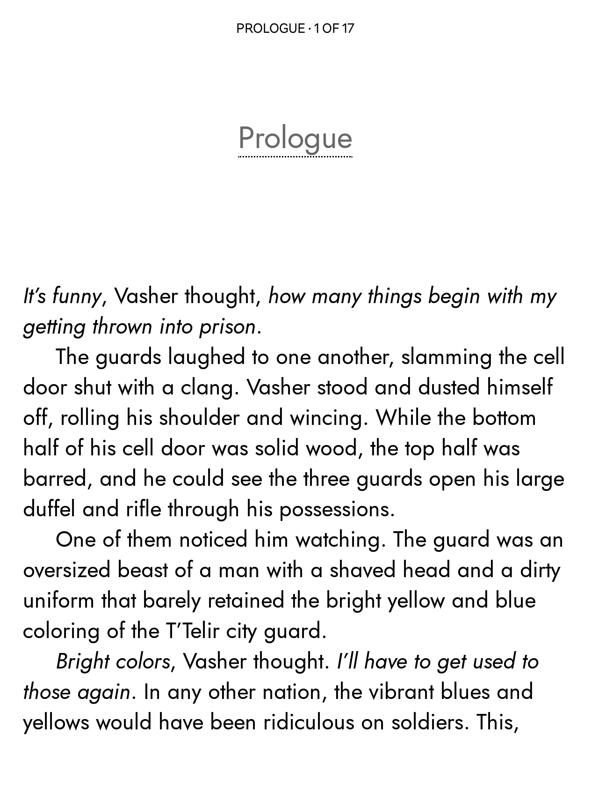
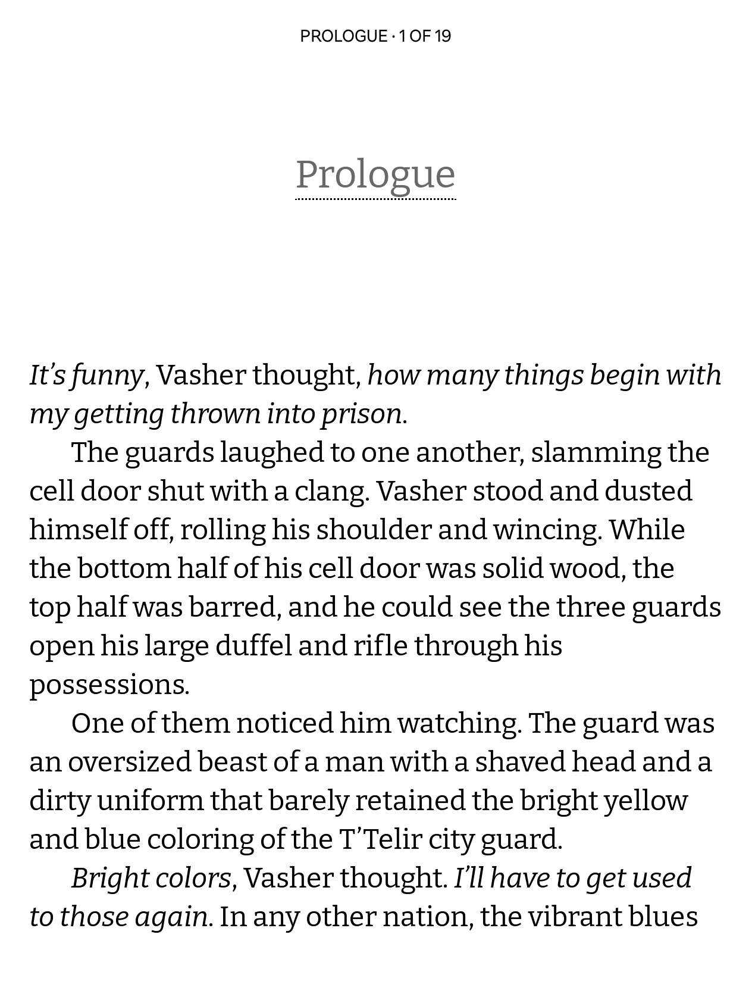

# Modified fonts for e-reading

This is a selection of fonts that I've tweaked for reading purposes on Kobo devices. 

**If you found these useful, please consider starring the repository!**

Included in the repository right now are my tweaked 'NV' fonts, but [the older release](https://github.com/nicoverbruggen/ebook-fonts/releases/tag/v2024.03) may still be of interest as I've included my initial batch of tweaked fonts mentioned in [the blog post](https://nicoverbruggen.be/blog/patching-fonts-for-kobo) there.

## Included tweaked fonts

### NV Garamond

<kbd></kbd>

 **NV Garamond** is an EB Garamond version that contains a bunch of tweaks, mostly related to glyph sizes. This one has a [dedicated repository](https://github.com/nicoverbruggen/nv-garamond) that I've linked. OFL licensed.

### NV Jost

<kbd></kbd>

**NV Jost** is a Jost variant, with a slightly altered lowercase G and single storey a (similar to Futura, only accessible via OT feature on the original font). This one has a [dedicated repository](https://github.com/nicoverbruggen/nv-jost) that I've linked, OFL licensed.

### NV Junius

<kbd></kbd>

**NV Junius** is a [Junicode 2](https://github.com/psb1558/Junicode-font) variant based on the variable font, with adjusted metrics and a 10% glyph size increase. This one does not have a repository, but can be easily recreated by using [Slice](https://github.com/source-foundry/Slice), a GUI that allows you to export various fixed configurations.

## Included renamed fonts

### NV Bitter

<kbd></kbd>

**NV Bitter** is a renamed version of [Bitter](https://www.huertatipografica.com/en/fonts/bitter-ht) (that can co-exist with Bitter if necessary). Intended for older Kobo devices that do not include an on-board version. Bitter is included by default on Kobo Clara BW and Kobo Libra Color. OFL licensed.

### NV Elstob

<kbd></kbd>

**NV Elstob** is a version of [Elstob](https://github.com/psb1558/Elstob-font) that has been renamed so it works correctly on Kobo devices. It is based on the 12pt version. Does not have a separate repository because no other changes were applied. OFL licensed.

### NV Cardo

<kbd></kbd>

**NV Cardo** is a version of [Cardo](https://github.com/ryanfb/Cardo) with 20% spacing and has been renamed so you can keep the original Cardo installed side-by-side as well. Does not have a separate repository because no other changes were applied. OFL licensed.

### NV Source Serif

<kbd></kbd>

**NV Source Serif** is a version of [Source Serif 4](https://github.com/adobe-fonts/source-serif) with 20% spacing and has been renamed so it works correctly on Kobo devices. Does not have a separate repository because no other changes were applied. OFL licensed.

### NV Charter

<kbd></kbd>

**NV Charter**, is a renamed version of [XCharter](https://www.ctan.org/tex-archive/fonts/xcharter/), which is an extended version of [Bitstream Charter](https://en.wikipedia.org/wiki/Bitstream_Charter). This one has a [dedicated repository](https://github.com/nicoverbruggen/nv-charter) that I've linked. Available under a [Free license](https://github.com/nicoverbruggen/nv-charter/blob/main/LICENSE).

### NV Palatium

<kbd></kbd>

**NV Palatium**, is a renamed version of [Domitian](https://www.ctan.org/tex-archive/fonts/domitian/), which is an extended version of [URW Palladio](https://tug.org/FontCatalogue/urwpalladio/). This one has a [dedicated repository](https://github.com/nicoverbruggen/nv-palatium) that I've linked. Available under a [Free license](https://github.com/nicoverbruggen/nv-palatium/blob/main/LICENSE).

### Where can I get the fonts?

The fonts are available via the [release](https://github.com/nicoverbruggen/ebook-fonts/releases).

You can learn more about how and why I originally made these tweaked fonts on my blog: [Patching Fonts for my Kobo](https://nicoverbruggen.be/blog/patching-fonts-for-kobo). I explain there why and how.

## How to install

To install these fonts on your Kobo, unzip the files and drag the font files into the `fonts` directory at the root of your Kobo device after connecting your Kobo to your PC via USB cable. You may need to create the `fonts` directory.

**I recommend rebooting your Kobo after installing the fonts to make sure they work correctly. A reboot is REQUIRED if you already had other versions of these fonts installed on your device, or the new versions won't be used.**

To reboot, long-press the power button until your Kobo says it has been shut down. Then, press the power button again and wait for your device to restart.

## FAQ

### What tweaks have been applied to these fonts?

- I've set a 20% line height (using `font-line percent 20`). Some fonts rendered poorly on Kobo devices with the line height slider all the way to the left. This fixes that!
- Most of the fonts have been renamed (using [fontname.py](https://github.com/chrissimpkins/fontname.py)). This way, you can keep them installed side-by-side with the original versions, if you'd like.
- Panose information has been corrected where necessary (using [panosifier](https://github.com/source-foundry/panosifier)). This ensures that the fonts render correctly on Kobo devices.

### How are these fonts licensed?

* Many of these fonts are available under their original [Open Font License](https://openfontlicense.org/).
* NV Charter is available under the original Bitstream license, which is included in the respective archive.
* NV Palatium is available under the OFL license, and is available under the same license as Domitian is.

### Is there anything else I should do?

If you are manually transferring books to your Kobo devices, you should consider converting `epub` files to `kepub` files. To do this, you can use [kepubify](https://pgaskin.net/kepubify/) or use [Calibre](https://calibre-ebook.com/). This ensures that your Kobo device will use a superior and faster book renderer. This renderer also gives you broader font compatibility.

### What is your favorite font from the collection?

* For simple books and basic readability, I personally prefer NV Charter or NV Jost.
* For fantasy books, I prefer to use NV Garamond or NV Cardo.